- [计算机网络](#计算机网络)
  - [计算机路由配置](#计算机路由配置)
  - [预加载](#预加载)
  - [HTTP Streaming](#http-streaming)
  - [grpc](#grpc)
  - [HTTP状态码304与ETag详解](#http状态码304与etag详解)
  - [HTTP Request 的 Header 信息](#http-request-的-header-信息)
  - [HTTP Response的Header信息](#http-response的header信息)
  - [域名解析过程](#域名解析过程)
- [HTML](#html)
  - [label 标签介绍](#label-标签介绍)
  - [i和em标签的区别](#i和em标签的区别)
- [CSS](#css)
  - [css 布局之 grid](#css-布局之-grid)
  - [主题切换](#主题切换)
  - [css 之 filter、backdrop-filter](#css-之-filterbackdrop-filter)
  - [提取图片主色调](#提取图片主色调)
  - [抖动css](#抖动css)
- [JS](#js)
  - [原型链](#原型链)
    - [怎么理解原型链?](#怎么理解原型链)
    - [手写 new](#手写-new)
  - [JS中的继承](#js中的继承)
    - [1. 构造函数、实例](#1-构造函数实例)
    - [2. 原型对象](#2-原型对象)
    - [3. 继承](#3-继承)
      - [组合继承](#组合继承)
      - [寄生组合式继承](#寄生组合式继承)
  - [js快慢数组](#js快慢数组)
  - [你写过axios请求拦截器的第二个参数吗](#你写过axios请求拦截器的第二个参数吗)
  - [CheckVersions](#checkversions)
  - [变量提升及词法作用域](#变量提升及词法作用域)
- [TS](#ts)
  - [TS 函数重载](#ts-函数重载)
  - [TS 和 JS 通信](#ts-和-js-通信)
  - [模糊TS的推断](#模糊ts的推断)
- [代码格式化](#代码格式化)
  - [eslint](#eslint)
  - [Vetur](#vetur)
- [前端场景](#前端场景)
  - [开发中的广告处理](#开发中的广告处理)
  - [常用的几种跨域解决方案](#常用的几种跨域解决方案)
    - [1. 修改本地 HOST](#1-修改本地-host)
    - [2. JSONP](#2-jsonp)
    - [3. CORS](#3-cors)
    - [4. Proxy](#4-proxy)
  - [前端关闭浏览器自动翻译功能](#前端关闭浏览器自动翻译功能)
  - [从Performance看浏览器渲染流程](#从performance看浏览器渲染流程)
    - [资源在浏览器中的生命周期](#资源在浏览器中的生命周期)
    - [前端资源加载流程](#前端资源加载流程)
      - [\<script\>的执行 依赖它上面的CSS加载](#script的执行-依赖它上面的css加载)
      - [\<script\>标签会阻塞 DOM 解析和渲染](#script标签会阻塞-dom-解析和渲染)
      - [外链 \<script\> 会触发页面的 Paint](#外链-script-会触发页面的-paint)
      - [\<link\> 标签不会阻塞 DOM 解析但会阻塞 DOM 渲染](#link-标签不会阻塞-dom-解析但会阻塞-dom-渲染)
    - [浏览器性能指标](#浏览器性能指标)
      - [FP(First Paint)](#fpfirst-paint)
      - [DCL(domContentLoaded)](#dcldomcontentloaded)
      - [L(loadEvent)](#lloadevent)
    - [结论](#结论)
      - [资源数据指标和用户视觉感知并不对等](#资源数据指标和用户视觉感知并不对等)
      - [提升网站速度方法](#提升网站速度方法)
      - [用户视觉层面的浏览器渲染](#用户视觉层面的浏览器渲染)
  - [Script标签中的async和defer](#script标签中的async和defer)
    - [普通Script](#普通script)
    - [Defer](#defer)
    - [Async](#async)
    - [推荐的应用场景](#推荐的应用场景)
      - [defer](#defer-1)
      - [async](#async-1)
  - [实现一个可以任意扩展接口的服务器，且能上传文件和文件下载](#实现一个可以任意扩展接口的服务器且能上传文件和文件下载)
    - [探究原理](#探究原理)
    - [文件上传方式](#文件上传方式)
      - [Base64](#base64)
      - [FormData](#formdata)
    - [切片上传](#切片上传)
      - [切片上传步骤](#切片上传步骤)
      - [上传进度条](#上传进度条)
      - [前端代码](#前端代码)
      - [后端](#后端)
    - [断点续传](#断点续传)
    - [生成Hash](#生成hash)
    - [维持浏览器最大并发数](#维持浏览器最大并发数)
    - [文件下载](#文件下载)
      - [直接下载](#直接下载)
      - [直接下载(使用 a 标签 download 属性)](#直接下载使用-a-标签-download-属性)
      - [直接下载(后端兼容处理 attachment)](#直接下载后端兼容处理-attachment)
    - [代码：upload-download](#代码upload-download)
- [算法](#算法)
  - [从交集时间中获取空闲时间段](#从交集时间中获取空闲时间段)
  - [ListToTree](#listtotree)
  - [LRU](#lru)
  - [hashtable](#hashtable)
  - [认识树](#认识树)
- [Docker](#docker)
  - [使用 docker 作为开发环境](#使用-docker-作为开发环境)
  - [使用 docker 私有部署项目](#使用-docker-私有部署项目)
- [Nginx](#nginx)
  - [nginx托管静态资源出现的问题](#nginx托管静态资源出现的问题)
    - [利用索引查找静态资源时会出现 301 重定向](#利用索引查找静态资源时会出现-301-重定向)
    - [try\_files](#try_files)
- [React](#react)
  - [基础语法](#基础语法)
    - [事件对象](#事件对象)
    - [Ref](#ref)
    - [Hooks](#hooks)
      - [Hooks要解决的问题](#hooks要解决的问题)
      - [useState](#usestate)
      - [useReducer](#usereducer)
      - [useContext](#usecontext)
      - [useEffect](#useeffect)
      - [useMemo](#usememo)
      - [momo](#momo)
      - [useCallback](#usecallback)
  - [性能优化之useMemo、useCallback](#性能优化之usememousecallback)
  - [性能优化之key](#性能优化之key)
  - [Ref 原理解读](#ref-原理解读)
- [Vue](#vue)
  - [ElementUI编辑数据resetFields失效](#elementui编辑数据resetfields失效)
- [工程化](#工程化)
  - [moment-locales-webpack-plugin插件](#moment-locales-webpack-plugin插件)
  - [前端请求错误优雅处理](#前端请求错误优雅处理)
    - [promise函数封装](#promise函数封装)
      - [修改思路](#修改思路)
      - [实践](#实践)
    - [axios封装](#axios封装)
- [杂七杂八](#杂七杂八)
  - [使用vnc访问远程系统](#使用vnc访问远程系统)
  - [mac安装windows虚拟机](#mac安装windows虚拟机)
  - [Mac 新电脑环境安装 2024.09.23](#mac-新电脑环境安装-20240923)
  - [终端代理](#终端代理)

# 计算机网络

## 计算机路由配置

假设计算机上有 wifi 和 网线两种连接方式，你输入一个网址后计算机无法知道采用哪种方式解析，路由表就是告诉计算机解析方式的。
使用 `netstat -nr` 查看路由表

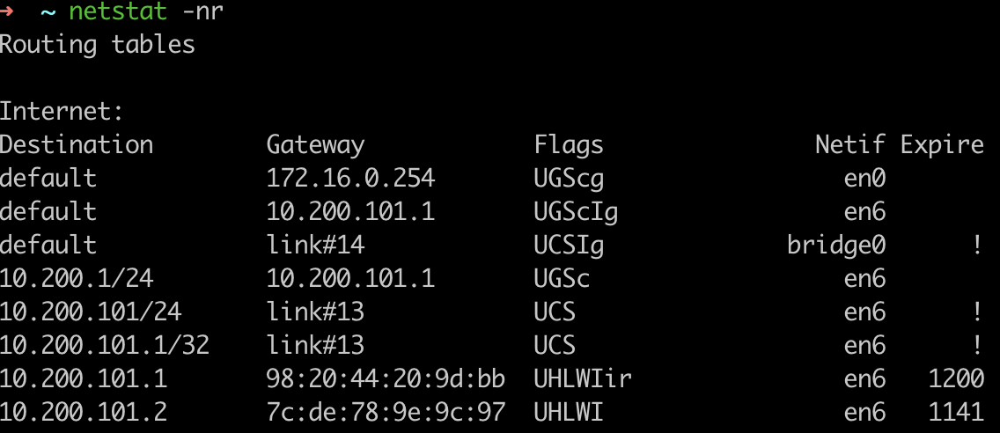

一二行是 wifi 和 网线的解析路径，下面 **10.200.1/24** 会采用网线解析，添加路由表的命令为：


```shell
sudo -S route -n add -net 192.100.50.0 -netmask 255.255.255.0 10.200.101.1 
```

## 预加载
网站性能优化思路：服务器响应时间（RT）优化、服务端渲染（SSR）与客户端渲染优化、以及静态资源体积的减少、**[网络开销](https://mp.weixin.qq.com/s/2C7w4iL4DLa1QXqq-37SAw)**，这里探讨最后一项
1. cdn 静态动态加速。静态加速适于更新频率低，对实时性要求不高的图片、视频、音频等资源，将静态资源缓存到数据中心并定期或不定期更新，用户访问最近的数据中心加快访问速度，缓存策略较简单；动态加速则需要结合负载均衡、智能路由、协议优化等多种技术手段，以实现对动态内容的快速响应，其核心在智能解析访问路径上，适于对实时性要求较高的场景，如电子商务交易、数据库查询等。
2. dns-prefetch DNS 预解析。在 HTML 顶部通过 \<link> 标签指示浏览器提前 DNS 解析此域名
```html
<link rel="dns-prefetch" href="//example.com">
```
3. preconenct 域名预建连。域名解析后提前与服务区建立连接，虽然花费较低但提前建立好的 TCP 连接只能开发一定时间，超过之后连接就白建立了，浪费 CPU 
```html
<link rel="preconnect" href="//example.com">
```
4. preload 与 prefetch 预加载。两个都是指示浏览器对资源提前下载，区别在于优先级，prefetch 优先级低，会在浏览器空闲时请求；preload 优先级高，无论浏览器是否空闲都需要提前返回，适于优先级比较低但是又急切需要的资源
5. prerender 预渲染。访问页面之前加载所有资源，但碍于用户行为预测不准、影响埋点和兼容性问题，此 api 很少使用
6. Speculation Rules API。提供一种声明式的方法来指示浏览器应该对哪些链接进行预取操作，通过这个 API，开发者可以更精确地指示浏览器在何时和如何预取资源
7. 流式渲染。

## HTTP Streaming

最近在看 The WebSocket Handbook，文章中提到了 http streaming 如下

> Also known as HTTP server push, HTTP streaming is a data transfer technique that allows a web server to continuously send data to a client over a single HTTP connection that remains open indefinitely. Whenever there’s an update available, the server sends a response, and only closes the connection when explicitly told to do so.
> HTTP streaming can be achieved by using the chunked transfer encoding mechanism available in HTTP/1.1. With this approach, the server can send response data in chunks of newline-delimited strings, which are processed on the fly by the client.

大致意思是 http 可以返回 stream 的代码块 chunk 供客户端实时处理
思考：碰到数据量级庞大的接口，服务返回十分缓慢，是否可以不等数据全部返回就处理数据，下面是具体应用
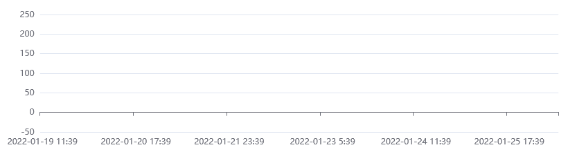

```javascript
const Koa = require('koa');
const path = require('path');
const fs = require('fs');
const koaStatic = require('koa-static');
const app = new Koa();

app.use(koaStatic(path.resolve('./public')))

app.use(ctx => {
  if (ctx.request.url === '/data') {
    ctx.response.set('content-type', 'application/json');
    // This is where the magic happens: set a stream as the response body
    ctx.body = fs.createReadStream('./data.json');
  }
})

app.listen(3000)
```

```html
<!DOCTYPE html>
<html lang="en">
  <head>
    <meta charset="UTF-8" />
    <meta http-equiv="X-UA-Compatible" content="IE=edge" />
    <meta name="viewport" content="width=device-width, initial-scale=1.0" />
    <title>Document</title>
  </head>
  <body>
    <div id="container" style="font-size: 12px"></div>
  </body>
</html>

<script>
  const startTime = Date.now()
  fetch('http://localhost:3000/data').then(async response => {
    // response.body is a ReadableStream
    const reader = response.body.getReader()
    renderStream(reader)
  })
  var text = ''
  const textDecoder = new TextDecoder()
  const containerDOM = document.querySelector('#container')

  async function renderStream(reader) {
    const { value, done } = await reader.read()
    if (done) {
      console.log('stream解析完成', Date.now() - startTime)
      return
    }
    // stream => string
    text += textDecoder.decode(value)
    containerDOM.innerHTML = text
    await renderStream(reader)
  }
</script>
```

对`ReadableStream`的处理可以参照[MDN](https://developer.mozilla.org/zh-CN/docs/Web/API/ReadableStream/getReader)
查看控制台可以看到响应体返回了 Transfer-Encoding: chunked 表明此接口是 stream 代码块返回
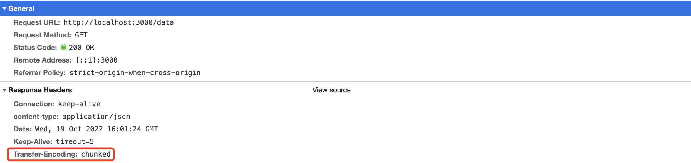
如果使用 HTTP2.0 则没有这个字段

```javascript
const Koa = require('koa');
const path = require('path');
const fs = require('fs');
const http2 = require('http2');
const koaStatic = require('koa-static');
const app = new Koa();


app.use(koaStatic(path.resolve('./public')))

app.use(ctx => {
  if (ctx.request.url === '/data') {
    ctx.response.set('content-type', 'application/json');
    // This is where the magic happens: set a stream as the response body
    ctx.body = fs.createReadStream('./data.json');
  }
})

// http 2.0 代码
http2.createSecureServer(
  {
      key: fs.readFileSync(path.resolve('./config/example.com+5-key.pem')),
      cert: fs.readFileSync(path.resolve('./config/example.com+5.pem')),
  },
  app.callback(),
).listen(3000);
```

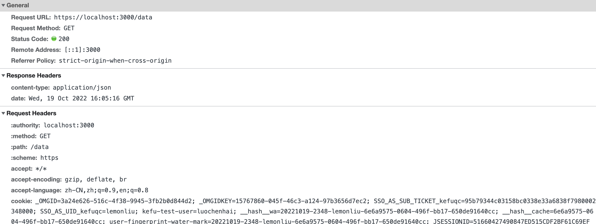
其中证书生成可以参考 [https 证书生成](#rTE3V)


## grpc

1. 什么是 grpc

- 使用Protocol Buffers作为接口定义语言（IDL），用于定义服务接口和数据结构。
- 使用HTTP/2作为传输协议，支持双向全双工通信、多路复用、标头压缩等高级功能。

2. grpc特点与优势：

- 高性能：gRPC基于HTTP/2，具有更高的传输效率和更低的延迟。其处理速度相较于JSON序列化可以快8倍，消息大小可以减少60%到80%。
- 跨平台与跨语言：gRPC支持几乎所有主流语言的实现，打破了语言隔阂，使得不同语言的服务之间可以高效通信。
- 功能丰富：支持负载平衡、跟踪、运行状况检查和身份验证等功能。
- 流式处理：内置流式处理，支持对大型数据集进行异步流式处理的请求和响应。
- 工具链成熟：代码生成便捷，开箱即用，降低了开发难度。

3. 我问文心一言：web已经支持http/2.0，为什么不能直接连接grpc？
   虽然Web已经支持HTTP/2.0，但Web浏览器和gRPC之间的连接存在一些限制和差异，导致它们不能直接进行连接。以下是主要的原因：

协议差异：
gRPC是基于HTTP/2的，但它不仅仅是HTTP/2。gRPC使用Protocol Buffers作为接口定义语言（IDL），并使用特定的序列化格式和传输机制。这与HTTP/2作为纯HTTP协议有所不同。
浏览器限制：
传统上，从browser-based应用程序使用gRPC是不可能的，因为浏览器不公开任何让JS/WASM代码直接控制HTTP/2请求的API。浏览器对HTTP/2的支持主要集中在作为HTTP协议的一部分，而不是作为gRPC的传输层。
gRPC-Web：
为了解决这个问题，gRPC社区开发了gRPC-Web，这是一个允许在浏览器中运行的客户端与gRPC服务进行通信的规范。gRPC-Web在HTTP/1.1上工作，并使用特殊的代理来将gRPC调用转换为可以在浏览器中执行的HTTP请求。
安全性考虑：
在浏览器中使用gRPC还涉及到安全性问题。由于gRPC使用Protocol Buffers作为消息格式，这可能需要特定的安全措施来确保浏览器中的代码不会被恶意消息所利用。
缺乏广泛支持：
尽管gRPC-Web提供了一种解决方案，但它尚未在所有服务器或客户端框架中得到广泛支持。这意味着不是所有的gRPC服务都可以直接与浏览器通信。
实现复杂性：
即使在服务器端和客户端都支持gRPC-Web的情况下，也需要额外的配置和设置来确保它们能够正确地通信。这增加了实现的复杂性。
综上所述，虽然Web支持HTTP/2.0，但由于协议差异、浏览器限制、安全性考虑、缺乏广泛支持以及实现复杂性等因素，浏览器不能直接连接gRPC服务。然而，通过使用gRPC-Web等技术，可以在一定程度上实现浏览器与gRPC服务之间的通信。


## HTTP状态码304与ETag详解

状态码304相关头信息

Last-Modified：响应头，表示当前资源的最后修改时间；

If-Modified-Since：请求头，表示缓存的资源最后修改时间；

状态码304：表示访问的资源没有改变


客户端首次访问服务器的静态资源index.html，服务器会把index.html响应给客户端，而且还会添加一个名为Last-Modified的响应头，它说明了当前index.html的最后修改时间

客户端收到响应后，会把index.html缓存在客户端上，而且还会把Last-Modified缓存起来。

客户端第二次请求index.html时，会添加名为If-Modified-Since的请求头，它的值是上次服务器响应头Last-Modified，服务器获取到客户端保存的最后修改时间，以及当前资源的最后修改时间进行比较，如果相同，说明index.html没有改动过，那么服务器不会发送index.html，而是响应状态码304，即通知客户端资源没有改变，你可以使用自己的缓存。

ETag 是 Entity Tag（实体标签）的缩写

在HTTP1.1协议中其实就是请求HEAD中的一个属性

```javascript
HTTP/1.1 200 OK
Date: Mon, 23 May 2005 22:38:34 GMT
Content-Type: text/html; charset=UTF-8
Content-Encoding: UTF-8
Content-Length: 138
Last-Modified: Wed, 08 Jan 2003 23:11:55 GMT
Server: Apache/1.3.3.7 (Unix) (Red-Hat/Linux)
ETag: "3f80f-1b6-3e1cb03b"
Accept-Ranges: bytes
Connection: close
```

ETag是HTTP1.1中才加入的一个属性，用来帮助服务器控制Web端的缓存验证。


它的原理是这样的，当浏览器请求服务器的某项资源(A)时, 服务器根据A算出一个哈希值(3f80f-1b6-3e1cb03b)并通过 ETag 返回给浏览器，浏览器把"3f80f-1b6-3e1cb03b" 和 A 同时缓存在本地，当下次再次向服务器请求A时，会通过类似 If-None-Match: “3f80f-1b6-3e1cb03b” 的请求头把ETag发送给服务器，服务器再次计算A的哈希值并和浏览器返回的值做比较，如果发现A发生了变化就把A返回给浏览器(200)，如果发现A没有变化就给浏览器返回一个304未修改。


这样通过控制浏览器端的缓存，可以节省服务器的带宽，因为服务器不需要每次都把全量数据返回给客户端。


通常情况下，ETag更类似于资源指纹(fingerprints)，如果资源发生变化了就会生成一个新的指纹，这样可以快速的比较资源的变化。在服务器端实现中，很多情况下并不会用哈希来计算ETag，这会严重浪费服务器端资源，很多网站默认是禁用ETag的。有些情况下，可以把ETag退化，比如通过资源的版本或者修改时间来生成ETag。


如果通过资源修改时间来生成ETag，那么效果和HTTP协议里面的另外一个控制属性(Last-Modified)就雷同了，使用 Last-Modified 的问题在于它的精度在秒(s)的级别，比较适合不太敏感的静态资源。


## HTTP Request 的 Header 信息

**1、HTTP请求方式**

GET         向Web服务器请求一个文件

POST        向Web服务器发送数据让Web服务器进行处理

PUT         向Web服务器发送数据并存储在Web服务器内部

HEAD        检查一个对象是否存在

DELETE     从Web服务器上删除一个文件

CONNECT   对通道提供支持

TRACE       跟踪到服务器的路径

OPTIONS    查询Web服务器的性能

 

说明：

主要使用到“GET”和“POST”。

实例：

POST /test/tupian/cm HTTP/1.1

分成三部分：

（1）POST：HTTP请求方式

（2）/test/tupian/cm：请求Web服务器的目录地址（或者指令）

（3）HTTP/1.1: URI（Uniform Resource Identifier，统一资源标识符）及其版本

备注：

​     在Ajax中，对应method属性设置。


**2、Host**

说明：

请求的web服务器域名地址

实例：

例如web请求URL：http://zjm-forum-test10.zjm.baidu.com:8088/test/tupian/cm

Host就为zjm-forum-test10.zjm.baidu.com:8088


**3、User-Agent**

说明：

HTTP客户端运行的浏览器类型的详细信息。通过该头部信息，web服务器可以判断到当前HTTP请求的客户端浏览器类别。

实例：

  User-Agent: Mozilla/5.0 (Windows; U; Windows NT 5.1; zh-CN; rv:1.8.1.11) Gecko/20071127 Firefox/2.0.0.11


**4、Accept**

说明：

指定客户端能够接收的内容类型，内容类型中的先后次序表示客户端接收的先后次序。

实例：

​     例如：

Accept:text/xml,application/xml,application/xhtml+xml,text/html;q=0.9,text/plain;q=0.8,image/png,*/*;q=0.5

备注：

在Prototyp（1.5）的Ajax代码封装中，将Accept默认设置为“text/javascript, text/html, application/xml, text/xml, */*”。这是因为Ajax默认获取服务器返回的Json数据模式。

在Ajax代码中，可以使用XMLHttpRequest 对象中setRequestHeader函数方法来动态设置这些Header信息。


**5、Accept-Language**

说明：

  指定HTTP客户端浏览器用来展示返回信息所优先选择的语言。

实例：

Accept-Language: zh-cn,zh;q=0.5

​     这里默认为中文。


**6、Accept-Encoding**

说明：

​     指定客户端浏览器可以支持的web服务器返回内容压缩编码类型。表示允许服务器在将输出内容发送到客户端以前进行压缩，以节约带宽。而这里设置的就是客户端浏览器所能够支持的返回压缩格式。

实例：

​     Accept-Encoding: gzip,deflate

备注：

其实在百度很多产品线中，apache在给客户端返回页面数据之前，将数据以gzip格式进行压缩。

另外有关deflate压缩介绍：

http://man.chinaunix.net/newsoft/ApacheMenual_CN_2.2new/mod/mod_deflate.html


**7、Accept-Charset**

说明：

​     浏览器可以接受的字符编码集。

实例：

​     Accept-Charset: gb2312,utf-8;q=0.7,*;q=0.7


**8、Content-Type**

说明：

显示此HTTP请求提交的内容类型。一般只有post提交时才需要设置该属性。

实例：

​     Content-type: application/x-www-form-urlencoded;charset:UTF-8

有关Content-Type属性值可以如下两种编码类型：

（1）“application/x-www-form-urlencoded”： 表单数据向服务器提交时所采用的编码类型，默认的缺省值就是“application/x-www-form-urlencoded”。 然而，在向服务器发送大量的文本、包含非ASCII字符的文本或二进制数据时这种编码方式效率很低。

（2）“multipart/form-data”： 在文件上载时，所使用的编码类型应当是“multipart/form-data”，它既可以发送文本数据，也支持二进制数据上载。

当提交为单单数据时，可以使用“application/x-www-form-urlencoded”；当提交的是文件时，就需要使用“multipart/form-data”编码类型。

在Content-Type属性当中还是指定提交内容的charset字符编码。一般不进行设置，它只是告诉web服务器post提交的数据采用的何种字符编码。

​     一般在开发过程，是由前端工程与后端UI工程师商量好使用什么字符编码格式来post提交的，然后后端ui工程师按照固定的字符编码来解析提交的数据。所以这里设置的charset没有多大作用。


**9、****Connection**

说明：

表示是否需要持久连接。如果web服务器端看到这里的值为“Keep-Alive”，或者看到请求使用的是HTTP 1.1（HTTP 1.1默认进行持久连接），它就可以利用持久连接的优点，当页面包含多个元素时（例如Applet，图片），显著地减少下载所需要的时间。要实现这一点， web服务器需要在返回给客户端HTTP头信息中发送一个Content-Length（返回信息正文的长度）头，最简单的实现方法是：先把内容写入ByteArrayOutputStream，然 后在正式写出内容之前计算它的大小。

实例：

**Connection: keep-alive**


**10、Keep-Alive**

说明：

​     显示此HTTP连接的Keep-Alive时间。使客户端到服务器端的连接持续有效，当出现对服务器的后继请求时，Keep-Alive功能避免了建立或者重新建立连接。

​     以前HTTP请求是一站式连接，从HTTP/1.1协议之后，就有了长连接，即在规定的Keep-Alive时间内，连接是不会断开的。

实例：

**Keep-Alive: 300**


**11、cookie**

说明：

​     HTTP请求发送时，会把保存在该请求域名下的所有cookie值一起发送给web服务器。

**12、Referer**

说明：

包含一个URL，用户从该URL代表的页面出发访问当前请求的页面


## HTTP Response的Header信息


**1、Content-Length**

说明：

​     表示web服务器返回消息正文的长度


**2、Content-Type:**

说明：

​     返回数据的类型（例如text/html文本类型）和字符编码格式。

实例：

Content-Type: text/html;charset=utf-8


**3、Date**

说明：

​     显示当前的时间


## 域名解析过程

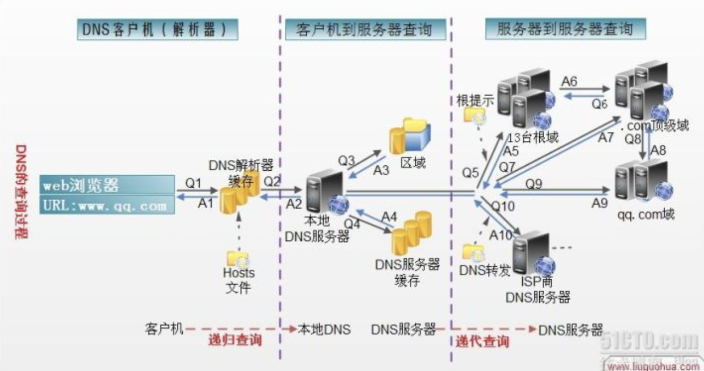

在网上看了很多的域名解析过程，但是每个考虑的都不是很全，这里把他们整理了一下。

我们拿 <font style="color:#121212;">www.qq.com  来举</font><font style="color:#121212;">🌰</font><font style="color:#121212;">：</font>

1. 在浏览器中输入 www.qq.com 域名，浏览器会在本地缓存中查找是否含有此域名的映射关系，如果有，<font style="color:#121212;">就调用这个IP地址映射，完成域名解析</font>
2. <font style="color:#121212;">如果浏览器没有这个域名映射，</font><font style="color:#121212;">操作系统会先检查自己本地的hosts文件是否有这个网址映射关系，如果有，就先调用这个IP地址映射，完成域名解析</font>
3. <font style="color:#121212;">如果hosts里没有这个域名的映射，则查找本地DNS解析器缓存，是否有这个网址映射关系，如果有，直接返回，完成域名解析</font>
4. 如果hosts与本地DNS解析器缓存都没有相应的网址映射关系，首先会找TCP/ip参数中设置的首选DNS服务器，在此我们叫它本地DNS服务器，此服务器收到查询时，如果要查询的域名，包含在本地配置区域资源中，则返回解析结果给客户机，完成域名解析，此解析具有权威性。
5. <font style="color:#121212;">如果要查询的域名，不由本地DNS服务器区域解析，但该服务器已缓存了此网址映射关系，则调用这个IP地址映射，完成域名解析，此解析不具有权威性。</font>
6. 如果本地DNS服务器本地区域文件与缓存解析都失效，则根据本地DNS服务器的设置（是否设置转发器）进行查询，如果未用转发模式，本地DNS就把请求发至13台根DNS，根DNS服务器收到请求后会判断这个域名(.com)是谁来授权管理，并会返回一个负责该顶级域名服务器的一个IP。本地DNS服务器收到IP信息后，将会联系负责.com域的这台服务器。这台负责.com域的服务器收到请求后，如果自己无法解析，它就会找一个管理.com域的下一级DNS服务器地址([http://qq.com](https://link.zhihu.com/?target=http%3A//qq.com))给本地DNS服务器。当本地DNS服务器收到这个地址后，就会找[http://qq.com](https://link.zhihu.com/?target=http%3A//qq.com)域服务器，重复上面的动作，进行查询，直至找到www.qq.com主机。
7. 如果用的是转发模式，此DNS服务器就会把请求转发至上一级DNS服务器，由上一级服务器进行解析，上一级服务器如果不能解析，或找根DNS或把转请求转至上上级，以此循环。不管是本地DNS服务器用是是转发，还是根提示，最后都是把结果返回给本地DNS服务器，由此DNS服务器再返回给客户机。

<font style="color:#121212;">从客户端到本地DNS服务器是属于递归查询，而DNS服务器之间就是的交互查询就是迭代查询。</font>


<font style="color:#121212;">这里涉及两个概念：递归查询和迭代查询。</font>

<font style="color:#333333;">递归是用户只向本地DNS服务器发出请求，然后等待肯定或否定答案。而迭代是本地服务器向根DNS服务器发出请求，而根DNS服务器只是给出下一级DNS服务器的地址，然后本地DNS服务器再向下一级DNS发送查询请求直至得到最终答案。</font>


# HTML

## label 标签介绍

label 标签为 input 元素提供标记，类似 span 标签，区别在于它为鼠标用户改进了可用性，可以关联特定表单控件

应用场景：1. 点击 label 聚焦 input 框 2. 点击 label 选中 checkbox 3. 点击 label 上传文件。特别提下第三点，默认的上传控件需要使用 input 元素并设置 type = 'file' 属性无法更改按钮内部文字和右侧文字，此时就可以使用  label 关联此控件，并把 input 元素隐藏

关联方式有两种：

显式关联：label 的 for 属性指向控件的 id

```html
<label for="username">用户名</label>
<input id="username" name="username">
```

隐式关联

```html
<label>
用户名<input id="username" name="username">
</label>
```

能使用显示关联的表单元素有：
input type="text" 文本框，点击标签时关联的文本框获得焦点。
input type="checkbox" 复选框，点击标签时选中或取消选中复选框。
input type="radio" 单选框，点击标签时选中单选框。
input type="file" 文件上传，点击标签时打开文件选择对话框。
input type="password" 密码框，点击标签时密码框获得焦点。
textarea 文本域，点击标签时文本域获得焦点。
select 下拉框，点击标签时，下拉框获得焦点，不过并不展开下拉框选项。


## i和em标签的区别

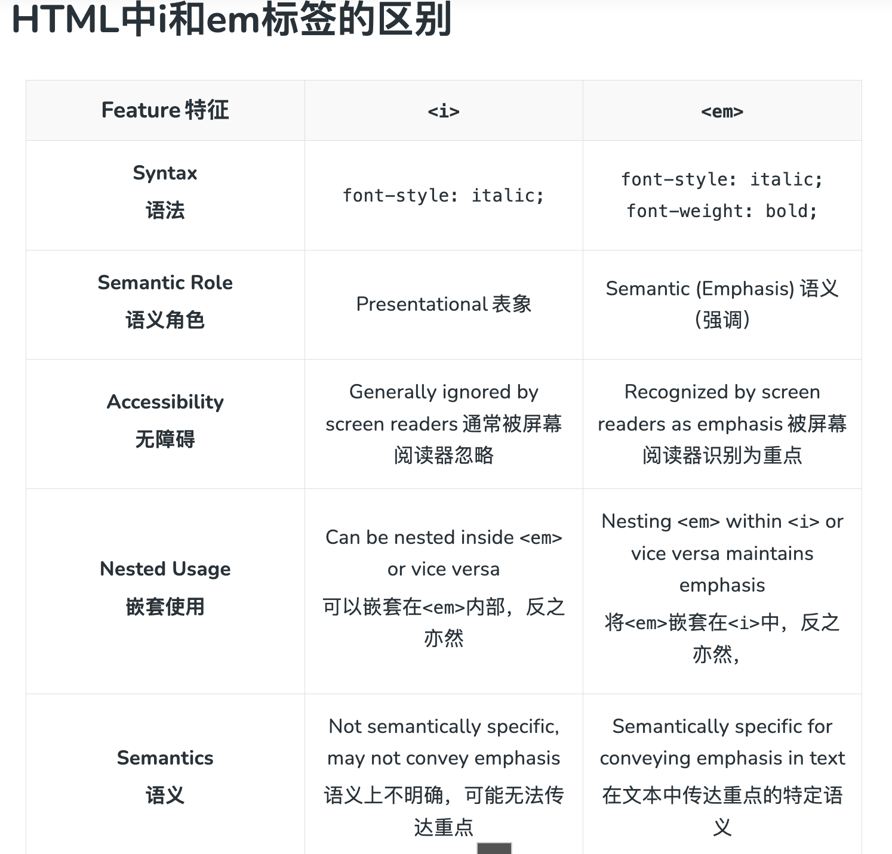

```html
<!DOCTYPE html>
<html>
<head>
	<title>b Tag</title>
	<style>
		body {
			text-align: center;
		}
		h1 {
			color: green;
		}
	</style>
</head>
<body>
	<h1>GeeksforGeeks</h1>
	<p><i>Iron Man</i> is a hero.</p>
	<p>Gfg is the <em>best</em> educational site.</p>
</body>
</html>
```

**Note:** Here, there is no added emphasis or importance on the word “Iron Man”. It just indicates here iron isn’t a mineral or metal but it refers to a character. But in the next sentence the reader will use verbal stress on the word “best”. 
**注：**在这里，没有对“钢铁侠”这个词的强调或重要性。它只是表明这里的铁不是一种矿物或金属，而是指一种性质。但在下一句中，读者会对“best”这个词使用动词重音。

```html
<!-- html5 标签 -->
<mark>This text is marked (mark tag)</mark>
<br/><br/>
<del>This text is deleted or invalid (del tag)</del>
<br/><br/>
<ins>This text is inserted (ins tag)</ins>
```


# CSS

## css 布局之 grid

使用 vscode Emmet Abbreviation 语法生成节点结构
```html
div.grid-content>(div.card>h2{some title}+p>lorem200)*10
```

期望实现效果：卡片的内容能根据屏幕宽度响应式变化，从而适应不同屏幕大小的设备

为什么不使用 flexbox ? 使用 flex-wrap 会造成最后一行如果没有充满宽度那么小卡片会铺满剩余空间不符合预期

具体实现：

```css
html {
  background-color: #000;
}
.grid-content {
  display: grid;
  /* 控制列数及列的宽度 */
  /* grid-template-columns: 250px 250px 250px; */ 
  /* 上面的简写 */
  /* grid-template-columns: repeat(4, 300px); */
  /* 4 1fr 重复四次 每部分占一份 响应式 */
  /* grid-template-columns: repeat(4, 1fr); */
  /* 固定宽度 gap无法填充剩余空间 */
  /* grid-template-columns: repeat(auto-fit, 300px); */
  /* minmax 函数指定每列最小最大宽度 */
  grid-template-columns: repeat(auto-fit, minmax(300px, 1fr));
  gap: 15px;
}
.card {
  padding: 2em;
  border: 1px solid rgb(75, 82, 92);
  border-radius: 10px;
  background: #222429;
  text-align: center;
  color: #fff;
}
```

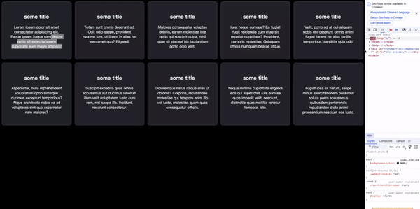

## 主题切换

谈一下`prefers-color-scheme`，它可以读取系统的主题类型让我们对网站进行主题适配
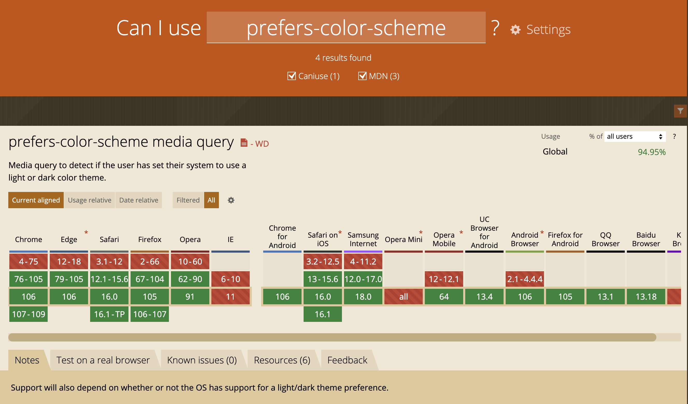

```css
/* default, light mode styling */
.element {
  background-color: #fff;
  color: #000;
}

/* if user switches the system settings to dark mode */
/* this media query will be applied */
@media (prefers-color-scheme: dark) {
  .element {
    background-color: #000;
    color: #fff;
  }
}
```
正常工作中为每个元素指定两种配色是十分繁琐的事情，可以采用全局变量的方式，也适用于svg元素
```html
<!DOCTYPE html>
<html lang="en">
  <head>
    <meta charset="UTF-8" />
    <meta http-equiv="X-UA-Compatible" content="IE=edge" />
    <meta name="viewport" content="width=device-width, initial-scale=1.0" />
    <title>Document</title>
  </head>
  <style>
    /* default, light mode styles set with variables */
    :root {
      --color-background: #f9f9f9;
      --color-default: #000;
      --color-accent-1: deepskyblue;
      --color-accent-2: violet;
    }

    body {
      background-color: var(--color-background);
    }

    /* Toggle button */
    .btn {
      background-color: var(--color-background);
      border: var(--color-default) solid 3px;
      color: var(--color-default);
    }

    /* SVG lightsabers */
    .first-blade {
      fill: var(--color-accent-1);
    }

    .second-blade {
      fill: var(--color-accent-2);
    }

    .handle {
      fill: var(--color-default);
    }
    /* 暗黑模式变量 */
    @media (prefers-color-scheme: dark) {
      :root {
        --color-background: #000;
        --color-default: #f9f9f9;
        --color-accent-1: cyan;
        --color-accent-2: magenta;
      }
    }
  </style>
  <body>
    <div class="wrapper">
      <svg class="lightsaber first" xmlns="http://www.w3.org/2000/svg" viewBox="0 0 97.01 97.1">
        <polygon class="handle" points="97.01 89.78 93.61 86.37 95.29 84.69 84.59 73.99 73.9 84.69 84.59 95.38 86.28 93.7 89.68 97.1 97.01 89.78" />
        <rect class="handle" x="66.92" y="72.23" width="15.13" height="4.68" transform="translate(-30.92 74.51) rotate(-45)" />
        <rect class="handle" x="60.5" y="65.81" width="15.13" height="4.68" transform="translate(-28.26 68.09) rotate(-45)" />
        <rect class="handle" x="51.88" y="59.39" width="19.53" height="4.68" transform="translate(-25.6 61.67) rotate(-45)" />
        <path class="blade first-blade" d="M59.57,54.27,6.41,1.11c-2.7-2.7-5.18.36-5.39.45A3.5,3.5,0,0,0,1,6.5L54.18,59.66Z" />
      </svg>
      <svg class="lightsaber second" xmlns="http://www.w3.org/2000/svg" viewBox="0 0 97.01 97.1">
        <polygon class="handle" points="97.01 89.78 93.61 86.37 95.29 84.69 84.59 73.99 73.9 84.69 84.59 95.38 86.28 93.7 89.68 97.1 97.01 89.78" />
        <rect class="handle" x="66.92" y="72.23" width="15.13" height="4.68" transform="translate(-30.92 74.51) rotate(-45)" />
        <rect class="handle" x="60.5" y="65.81" width="15.13" height="4.68" transform="translate(-28.26 68.09) rotate(-45)" />
        <rect class="handle" x="51.88" y="59.39" width="19.53" height="4.68" transform="translate(-25.6 61.67) rotate(-45)" />
        <path class="blade second-blade" d="M59.57,54.27,6.41,1.11c-2.7-2.7-5.18.36-5.39.45A3.5,3.5,0,0,0,1,6.5L54.18,59.66Z" />
      </svg>
      <button class="btn">Toggle mode</button>
    </div>
  </body>
</html>
```
**图片的处理**

1. 使用选择性加载的`picture`标签
```html
<picture>
  <source srcset="light-image.jpg" media="(prefers-color-scheme: light)" />
  <source srcset="dark-image.jpg" media="(prefers-color-scheme: dark)" />
	<!--  默认图片  -->
  
</picture>
```

2. 给图片增加css滤镜
```css
@media (prefers-color-scheme: dark) {
  /* we are excluding SVG */
  img:not([src$=".svg"]) {
    filter: brightness(70%);
  }
}
```
`**color-scheme**`
有些系统自带的控件如表单控件、滚动条并没有完全适配主题，需要添加 color-scheme  meta 标签告诉浏览器网站支持主题切换
将以下 meta 标签添加到文档头部，content 字段制定文档支持的主题模式
```html
<meta name="color-scheme" content="light dark" />
```
或者，color-scheme可以作为 CSS 属性添加到样式表中的任何元素上。
```css
color-scheme: light dark;
```
只使用 CSS 条件规则很难实现某些需求，使用 js 如何获取媒体查询的结果？
在 window 对象中有这样一个方法：matchMedia，几乎所有浏览都支持它，因此可以放心的使用。这个方法只接受一个参数，就是媒体查询的字符串，并返回一个 MediaQueryList 对象实例。该对象有只有 3 个属性：

1. media：媒体查询，等于传入的参数。
2. matches：布尔值，表示查询结果正确与否。
3. onchange：null，允许开发者传入一个回调函数，当媒体查询的结果改变时就会被触发。
```javascript
// 本例通过设置 body 的 classname 来控制主题颜色。 
const mql = window.matchMedia(`(prefers-color-scheme: dark)`);
if(mql.matches) {
  // 当前为 dark 模式
  document.body.classList.add('dark-mode')
} else {
  // 当前为 light 模式
  document.body.classList.remove('dark-mode')
}
```
如果网站想监听系统主题切换，可以设置 onchange 回调函数
```javascript
const mql = window.matchMedia(`(prefers-color-scheme: dark)`);
mql.onchange = function(evt) {
  if(mql.matches) {
  	document.body.classList.add('dark-mode')
	} else {
  	document.body.classList.remove('dark-mode')
	}
}
```
附一键切换深色主题魔法代码
```css
.dark-mode {
  filter: invert(1) hue-rotate(180deg);
}
```
附其他几个新增 css 媒体查询，为网站增加无障碍功能

- prefers-reduced-motion 减弱动画效果
- prefers-contrast 调整内容色彩对比度
- prefers-reduced-transparency 减少透明元素
- prefers-reduced-data 减少数据传输

## css 之 filter、backdrop-filter
具体配置查看[filterMDN](https://developer.mozilla.org/zh-CN/docs/Web/CSS/filter)、[backdrop-filterMDN](https://developer.mozilla.org/zh-CN/docs/Web/CSS/backdrop-filter)，这里说几个采用他们实现的 css 效果
```css
filter: blur(5px);
```

```css
backdrop-filter: saturate(50%) blur(4px);
background: rgba(255,255,255,.7);
```
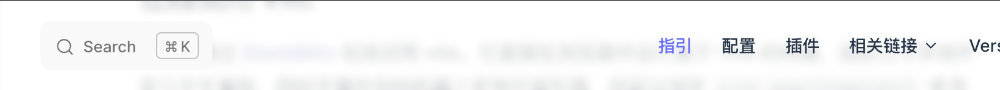
```css
.logo:hover {
  filter: drop-shadow(0 0 2em #646cffaa);
}
.logo.react:hover {
  filter: drop-shadow(0 0 2em #61dafbaa);
}
```


## 提取图片主色调

```javascript
const img = new Image()
  img.src = './avatar.jpeg'
  img.setAttribute('width', 1)
  img.setAttribute('height', 1)
  img.onload = () => {
    const canvas = new OffscreenCanvas(1, 1)
    const ctx = canvas.getContext('2d')
    ctx.drawImage(img, 0, 0, 1, 1)
    const { data } = ctx.getImageData(0, 0, 1, 1)
    console.log(`rgba(${data.join(',')})`)
    document.body.style = 'background: ' + `rgba(${data.join(',')})`
  }
```

## 抖动css

```vue
<style>
  @keyframes shake {
    10%,
    90% {
      transform: translate3d(-1px, 0, 0);
    }

    20%,
    80% {
      transform: translate3d(2px, 0, 0);
    }

    30%,
    50%,
    70% {
      transform: translate3d(-4px, 0, 0);
    }

    40%,
    60% {
      transform: translate3d(4px, 0, 0);
    }
  }

  .apply-shake {
    animation: shake 0.82s cubic-bezier(0.36, 0.07, 0.19, 0.97) both;
  }
</style>
```


# JS
## 原型链

### 怎么理解原型链?

```js
function Person (name) {
  this.name = name
  this.speak = function () {
    console.log(`我叫${this.name}`)
  }
}

const zhangsan = new Person('张三')
const lisi = new Person('李四')

console.log(zhangsan.speak === lisi.speak) // false
```

每创建一个实例就会产生一个相同的函数占用内存,如何节省? js 给构造函数创建了一个"共享空间"——prototype,使用构造函数创建的实例都可以访问到共享空间的属性

```js
function Person (name) {
	this.name = name
}

Person.prototype.speak = function () {
  console.log(`我叫${this.name}`)
}

const zhangsan = new Person('张三')
const lisi = new Person('李四')

console.log(zhangsan.speak === lisi.speak) // true
```

“共享空间”本质上是一个对象,对象上的方法存在于 Object.prototype 上,Object的共享空间是 null,这个链式结构称为原型链

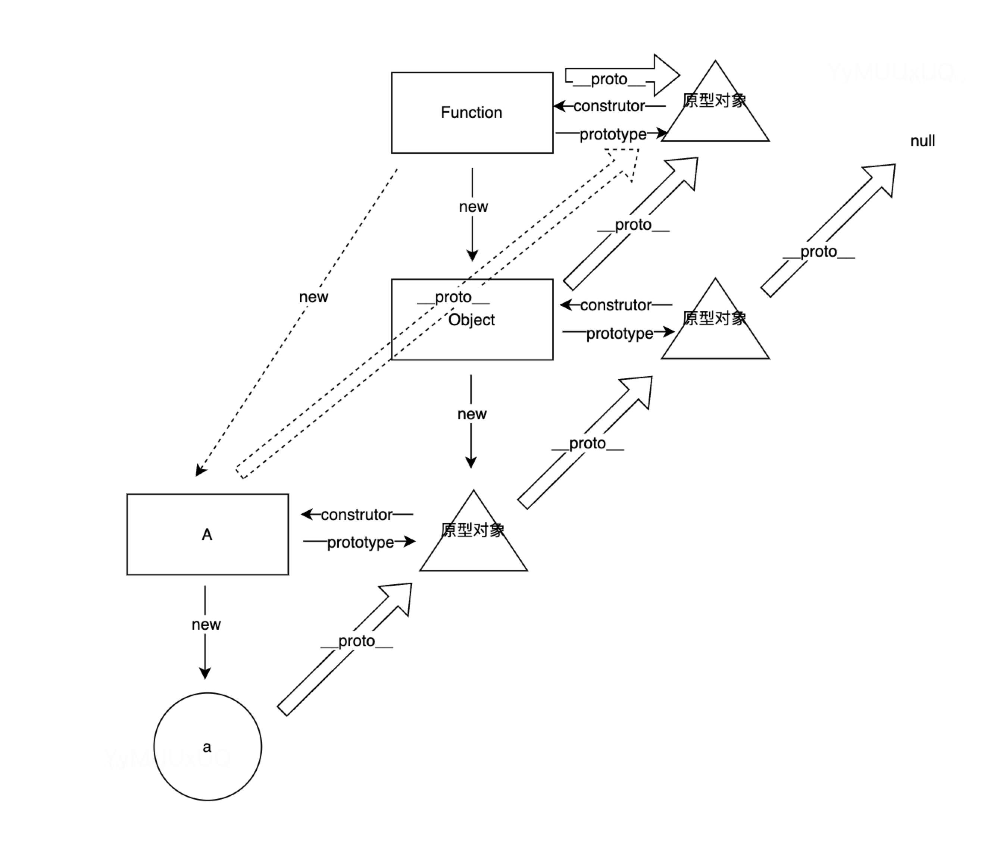

### 手写 new

```js
//Fun为构造函数, args表示传参
function myNew(Fun, ...args) {
    // 1.在内存中创建一个新对象
    let obj = {};
    // 2.把新对象的原型指针指向构造函数的“共享空间“
    obj.__proto__ = Fun.prototype;
    // 3.改变this指向，并且执行构造函数内部的代码（传参）
    let res = Fun.apply(obj, args);
    // 4.判断函数执行结果的类型
    if (res instanceof Object) {
        return res;
    } else {
        return obj;
    }
}

let obj = myNew(One, "XiaoMing", "18");
```


## JS中的继承

### 1. 构造函数、实例

构造函数是用来创建对象的函数，本质上与普通函数无区别，只是调用方式有异

- 如果用 new 操作符来调用的就是构造函数
- 没有用 new 操作符直接调用的就是普通函数
- 为了区分两者，口头约定构造函数的首字母大写

🌰：

```javascript
function Person(name, age) {
	this.name = name
  this.age = age
}
const person1 = new Person('lm', 20)
```

上文中的 person1 就称为 **构造函数**，person1 称为 Person 函数对象的一个 **实例**


### 2. 原型对象

我们每次创建一个函数的时候，函数对象都会有一个 prototype 属性，这个属性是一个指针，指向它的原型对象

🌰：

```javascript
function Person(name, age) {
	this.name = name
  this.age = age
}
console.log(Person.prototype) // object {constructor: Person}
const person1 = new Person()
console.log(person1.__proto__) // object {constructor: Person}
```

可以看到`Person.prototype`指向了一个对象，即**Person的原型对象**，并且这个对象有一个`constructor`属性，又指向了`Person`函数对象，而且实例 person1 的 `__proto__` 也指向了 Person的原型对象，所以他们之间存在如下关系

Person.prototype === person1.__proto__

Person.prototype.constructor === Person


### 3. 继承

继承本质上就是子类身上存在父类身上的属性和方法并且保持原型链的完整性

有如下构造函数

```javascript
function Person(name, age) {
	this.name = name
  this.age = age
}
```

#### 组合继承

```javascript
function Person(name, age) {
    this.name = name;
    this.age = age;
}

function Child(name) {
    Person.call(this, name)
}

Child.prototype = new Person();

const child1 = new Child('foo');

console.log(child1) // => Person { name: 'foo', age: undefined }
```

特点：1、可以继承父类原型上的属性，可以传参，可复用。

　　　2、每个新实例引入的构造函数属性是私有的。

缺点：调用了两次父类构造函数（耗内存），子类的构造函数会代替原型上的那个父类构造函数。


#### 寄生组合式继承

```javascript
function Person(name, age) {
    this.name = name;
    this.age = age;
}

function content(obj) {
    function F() {}
    F.prototype = obj;
    return new F()
}

const con = content(Person.prototype)

function Child(name) {
    Person.call(this, name)
}

Child.prototype = con;

const child1 = new Child('foo');

console.log(child1)
```

简单写法：

```javascript
function A() {
  this.a = 'hello';
}

function B() {
  A.call(this);
  this.b = 'world';
}

B.prototype = Object.create(A.prototype, {
  constructor: { value: B, writable: true, configurable: true }
});

let b = new B();
```


## js快慢数组

[前端进阶算法2：从Chrome V8源码看JavaScript数组](https://github.com/sisterAn/JavaScript-Algorithms/issues/2)

总结：v8 封装底层数组自动扩容减容，减少开发者认知负担

## 你写过axios请求拦截器的第二个参数吗
最近在重构老项目逻辑时，需要对axios进行二次封装，在写到请求拦截器的第二个参数时突然有个疑问，什么时候第二个reject函数参数执行呢？

现在翻阅一些博客，大部分都会默认写上这个处理

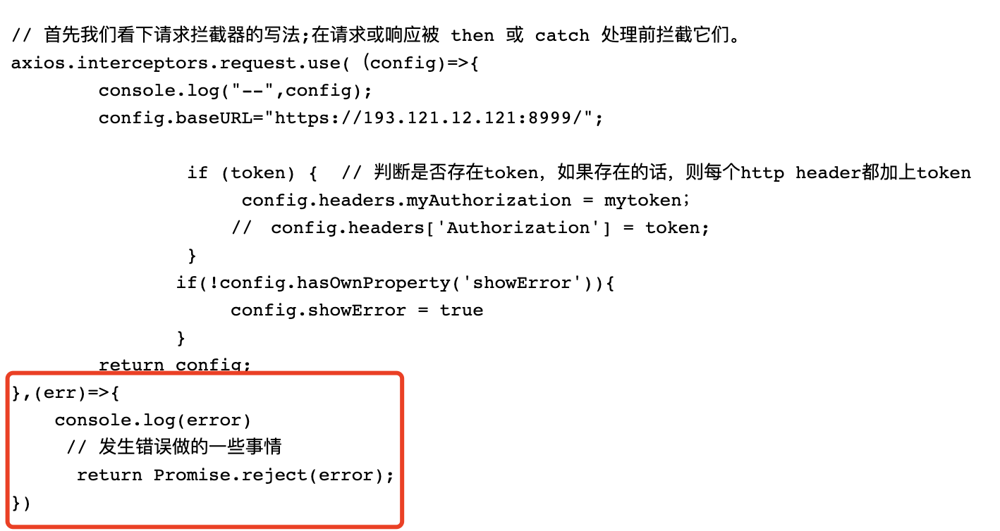

调用时机呢？一些文章解释网络错误的时候会走

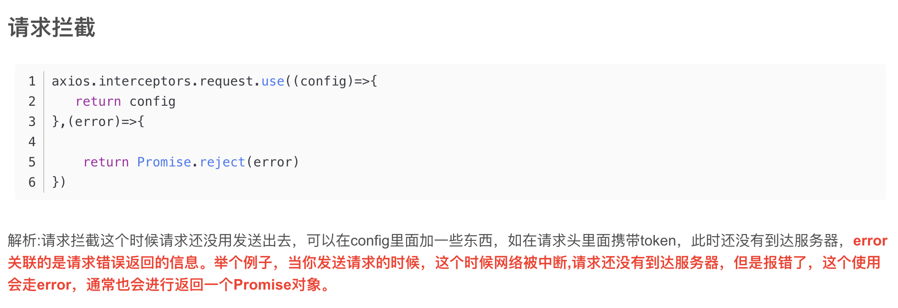

从历史写代码的经验来看，如果错误了会走到响应拦截器的第二个参数，好像并没有执行请求拦截器的代码(我研究的是axios0.19.x之后的代码，不排除之前版本的axios是这个逻辑)

我看了axios0.19.x和0.27.x的源码，这两个版本对于这部分的处理还是不相同的，先来一个简单的


**一、0.19.x版本**
```javascript
// axios/lib/core/Axios.js
Axios.prototype.request = function request(config) {
  /*eslint no-param-reassign:0*/
  // Allow for axios('example/url'[, config]) a la fetch API
  if (typeof config === 'string') {
    config = arguments[1] || {};
    config.url = arguments[0];
  } else {
    config = config || {};
  }

  config = mergeConfig(this.defaults, config);
  config.method = config.method ? config.method.toLowerCase() : 'get';

  // Hook up interceptors middleware
  var chain = [dispatchRequest, undefined];
  var promise = Promise.resolve(config);

  this.interceptors.request.forEach(function unshiftRequestInterceptors(interceptor) {
    chain.unshift(interceptor.fulfilled, interceptor.rejected);
  });

  this.interceptors.response.forEach(function pushResponseInterceptors(interceptor) {
    chain.push(interceptor.fulfilled, interceptor.rejected);
  });

  while (chain.length) {
    promise = promise.then(chain.shift(), chain.shift());
  }

  return promise;
};
```

首先从第19行可以看出，axios的请求拦截器是支持传多个的，最终会都传到`this.interceptors.request`的数组中

第16行的`chain`是一个数组，默认存储的是`dispatchRequest请求`和`undefined`，而后会将请求拦截器的处理函数插到chain数组的头，如果我们只配置了一个请求拦截器，此时的chain为

```javascript
var chain = [interceptor.fulfilled, interceptor.rejected, dispatchRequest, undefined]
```

而后27行开始执行，`promise`默认第一次是`Promise.resolve(config)`，.then链式调用

```javascript
promise = promise.then(interceptor.fulfilled, interceptor.rejected)
```

此时的promise是不可能走到reject状态的，所以**如果配置了一个请求拦截器第二个函数参数是永远不会走的**

那什么时候会走呢？

我们来多配置一个请求拦截器

```javascript
var chain = [interceptor1.fulfilled, interceptor1.rejected,interceptor2.fulfilled, interceptor2.rejected, dispatchRequest, undefined]
```

刚开始还是上面的逻辑，当走到第二个promise时

```javascript
promise = promise.then(interceptor2.fulfilled, interceptor2.rejected)
```

此时的promise为第一个请求拦截器的调用，如果**第一个请求拦截器的第一个fulfilled函数出错的时候，就会调用第二个请求拦截器的第二个参数，是跨级的promise**


**二、0.27.x版本**
相比于0.19.x，0.27.x版本增加了同步异步的配置，大概原因是解决前面版本的拦截器只能链式同步走的问题

```javascript
Axios.prototype.request = function request(configOrUrl, config) {
  // ...
  // filter out skipped interceptors
  var requestInterceptorChain = [];
  var synchronousRequestInterceptors = true;
  this.interceptors.request.forEach(function unshiftRequestInterceptors(interceptor) {
    if (typeof interceptor.runWhen === 'function' && interceptor.runWhen(config) === false) {
      return;
    }

    synchronousRequestInterceptors = synchronousRequestInterceptors && interceptor.synchronous;

    requestInterceptorChain.unshift(interceptor.fulfilled, interceptor.rejected);
  });

  var responseInterceptorChain = [];
  this.interceptors.response.forEach(function pushResponseInterceptors(interceptor) {
    responseInterceptorChain.push(interceptor.fulfilled, interceptor.rejected);
  });

  var promise;

  if (!synchronousRequestInterceptors) {
    var chain = [dispatchRequest, undefined];

    Array.prototype.unshift.apply(chain, requestInterceptorChain);
    chain = chain.concat(responseInterceptorChain);

    promise = Promise.resolve(config);
    while (chain.length) {
      promise = promise.then(chain.shift(), chain.shift());
    }

    return promise;
  }


  var newConfig = config;
  while (requestInterceptorChain.length) {
    var onFulfilled = requestInterceptorChain.shift();
    var onRejected = requestInterceptorChain.shift();
    try {
      newConfig = onFulfilled(newConfig);
    } catch (error) {
      onRejected(error);
      break;
    }
  }

  try {
    promise = dispatchRequest(newConfig);
  } catch (error) {
    return Promise.reject(error);
  }

  while (responseInterceptorChain.length) {
    promise = promise.then(responseInterceptorChain.shift(), responseInterceptorChain.shift());
  }

  return promise;
};
```

第23、39行是两段是对请求拦截器的两种处理，区别在于 `synchronousRequestInterceptors`是 true / false

第5、11行是对`synchronousRequestInterceptors`变量的处理，依赖的是 `interceptor.synchronous`，它是通过第三个options参数传过来的，如下

```javascript
axios.default.interceptors.request.use((config) => {
  return config
}, (err) => {
  return Promise.reject(err)
}, {
  synchronous: true
})
```

默认是`undefined`，则默认走的是0.19.x版本的链式同步逻辑

如果所有请求拦截器传的都是true，则走异步逻辑

从39行开始，它将**所有请求拦截器的函数异步执行，第二个参数会在第一个参数出错后执行，是同级的promise**


## CheckVersions

```javascript
'use strict'
const chalk = require('chalk')
const semver = require('semver')
const packageConfig = require('../package.json')
const shell = require('shelljs')

function exec (cmd) {
  return require('child_process').execSync(cmd).toString().trim()
}

const versionRequirements = [
  {
    name: 'node',
    currentVersion: semver.clean(process.version),
    versionRequirement: packageConfig.engines.node
  }
]

if (shell.which('npm')) {
  versionRequirements.push({
    name: 'npm',
    currentVersion: exec('npm --version'),
    versionRequirement: packageConfig.engines.npm
  })
}

module.exports = function () {
  const warnings = []

  for (let i = 0; i < versionRequirements.length; i++) {
    const mod = versionRequirements[i]

    if (!semver.satisfies(mod.currentVersion, mod.versionRequirement)) {
      warnings.push(mod.name + ': ' +
        chalk.red(mod.currentVersion) + ' should be ' +
        chalk.green(mod.versionRequirement)
      )
    }
  }

  if (warnings.length) {
    console.log('')
    console.log(chalk.yellow('To use this template, you must update following to modules:'))
    console.log()

    for (let i = 0; i < warnings.length; i++) {
      const warning = warnings[i]
      console.log('  ' + warning)
    }

    console.log()
    process.exit(1)
  }
}
"engines": {
    "node": ">= 6.0.0",
    "npm": ">= 3.0.0"
  },
```


## 变量提升及词法作用域

**词法作用域 (Lexical Scope)**

词法作用域也就是在词法阶段定义的作用域，也就是说词法作用域在代码书写时就已经确定。

每个函数都有自己的词法作用域，词法作用域保存在自身函数属性 `[[Scope]]` 中，在该 `[[Scope]]` 中会预先包含至全局变量对象的作用域链。

可通过 `eval` 和 `with` 来改变词法作用域，但不建议使用。

词法作用域中存放着代表变量或函数的标识符。

看以下示例：

```javascript
var a = 10

function fn() {
  console.log(a)
}

function run() {
  var a = 20
  fn()
}

run() // 打印结果：10
```


如果按按动态作用域来说，`a` 的值应该是 20，但 `JavaScript` 是静态作用域，所以在编译时就确认了函数自身的作用域，在编译时函数 `fn` 里没有变量 `a`，但它的父执行上下文是全局上下文，在全局上下文中变量 `a` 的值是10。

**🌰**

```javascript
console.log(a);
console.log(typeof yideng(a));
var flag = true;
if(!flag) {
    var a = 1;
}
if(flag) {
    function yideng(a) {
        yideng = a;
        console.log('yideng1');
    }
} else {
    function yideng(a) {
        yideng = a;
        console.log('yideng2');
    }
}
```

这里存在两种两个词法作用域，一个是全局另一个是函数内，所以第一行的代码不会报错


# TS

## TS 函数重载

Ts 函数重载，第一个参数不同影响第二个参数，先把每种情况写出来，再写一个聚合的 使用 ｜


## TS 和 JS 通信

1. 可以使用模版字符串的形式 \``
2. 映射

```ts
type JSTypeMap = {
  number: number;
  string: string;
  symbol: Symbol;
  function: Function;
};

type JSTypes = keyof JSTypeMap;

type ArgsType<T extends JSTypes[]> = {
    [K in keyof T]: JSTypeMap[T[K]]
}

type RulesType<T extends Record<string, JSTypes>> = {
  [K in keyof T]: JSTypeMap[T[K]];
};

declare function addImpl<T extends JSTypes[]>(...args: [
    ...T,
    (...args: ArgsType<T>) => any
]): any


addImpl('string', 'function', (a, b) => {})

declare function validate<T extends Record<string, JSTypes>>(
  rules: T,
  obj: any
): RulesType<T>;

const res = validate(
  {
    a: 'string',
    b: 'number',
  },
  { a: '1', b: 2 }
);

const a = res.a; // string
const b = res.b; // number
```


## 模糊TS的推断

Let’s say you have a piece of typescript code like below:

```ts
const letterAspectRatio = {
  a: 0.5589996337890625,
  A: 0.6569992065429687,
} as const
const getLetterWidth = (letter: string, fontSize: number) => {
  return letterAspectRatio[letter] || 1
}
getLetterWidth('foo')
```

ts 会报类似`Element implicitly has an ‘any’ type because expression of type ‘string’ can’t be used to index type`的错误，原因是 ts 把 letterAspectRatio 的 key 和 value 的类型也推断了，类型为 { readonly a: 0.5589996337890625...  }，如果随意传入 letter: string 它就认为是错误，很显然上面的代码是想利用 js 对象取值的逻辑如果取到返回对应值否则返回 undefined，如何避免 ts 报错呢？

查询 stackoverflow 大部分人的思路是欺骗 ts，虽然能避免编辑器飘红，但逻辑上说不通，letter 传入到下面就是 string 类型，不应直接断言为 letterAspectRatio 的 key

```ts
const getLetterWidth = (letter: string, fontSize: number) => {
  return letterAspectRatio[letter as keyof typeof letterAspectRatio] || 1
}
```

我的想法是在 letterAspectRatio 上加一个类型声明，模糊ts推断，只推断 letter 的类型为 string。注意这个常量一般会被导出，所以不应直接修改它的类型而是重新声明一个变量

```ts
const letterAspectRatio = {
  a: 0.5589996337890625,
  A: 0.6569992065429687,
} as const
const letterAspectRatioCache: Record<string, number> = letterAspectRatio
const getLetterWidth = (letter: string, fontSize: number) => {
  return letterAspectRatioCache[letter] || 1
}
getLetterWidth('foo')
```


# 代码格式化
## eslint
对于 js 代码格式化，有 tslint、eslint、prettier 工具，每个功能基本差不多，我见到的很多项目都使用了两个或者三个工具。那么项目中的代码规范到底是什么呢，除了潦草几句 README 里的规范，其他的就只能在写代码的时候见真章了
你应该见过在 终端 里见到的代码格式错误，比如 xxx is not defined... 这个是通过 eslint-loader 实现，eslint-loader 依赖 eslint；你也见过在 IDE 上标红标黄的 lint 错误，这个是通过 tslint/eslint/prettier 实现的，鼠标 hover 住，可以看到具体是哪个工具的哪个 rule 出错了
我不喜欢 prettier，虽然他支持多语言 html、js、css ... 的格式化，不到五分钟集成 Prettier，让你的代码变得更漂亮。但是他太严格了，比如 `printWidth` 规则，规定代码的最大长度，试想一下，你在字符串里添加几个字母，prettier 会让你强制换行，这样对于 git diff  极其不友好，无法清楚知道你修改了什么；对于对象，你肯定见过以下代码
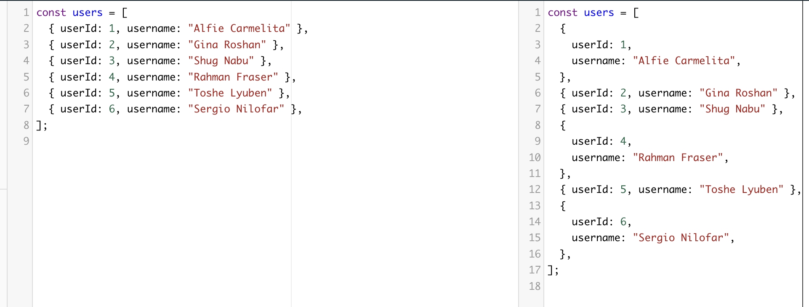
左右两部分代码哪个漂亮十分明显，而想要禁用他的规则是十分困难的，唯一能做的是使用 `**// prettier-ignore**`
从上面分析可以看出，eslint 可以满足两个功能，为什么项目中不只用 eslint 呢？答案是可以的。
eslint 有很多预设，还有很多公司开发的规范插件，比如 airbnb。里面具体的规则是什么呢，你可能需要从 node_modules 中去查看，对于大部分人来说，很少有人关心里面的具体 rules，只要在项目中的 eslint 配置中修改相应 rules 就可以了，下面记录下贴合我代码规范的 rules
```javascript
module.exports = {
  env: {
    browser: true,
    es2021: true,
  },
  'settings': {
    'import/resolver': {
      'node': {
        'extensions': ['.js', '.jsx', '.ts', '.tsx', '.css']
      }
    }
  },
  extends: [
    'eslint:recommended',
    'plugin:import/recommended',
    'plugin:react/recommended',
    'plugin:@typescript-eslint/recommended',
  ],
  overrides: [],
  parser: '@typescript-eslint/parser',
  parserOptions: {
    ecmaVersion: 'latest',
    sourceType: 'module',
  },
  plugins: ['react', '@typescript-eslint'],
  rules: {},
}

```

- no-multi-spaces  不能使用多余空格

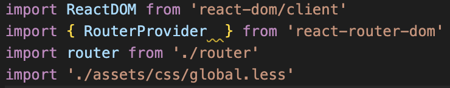

- react/react-in-jsx-scope react 在 jsx 中可以不声明

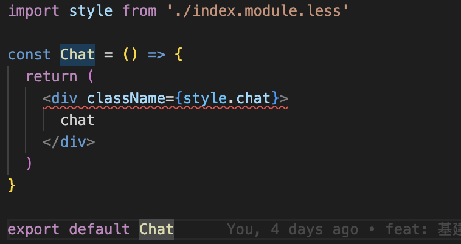

- quotes  单引号替代双引号
- semi 不使用分号
- react/jsx-indent-props JSX中的props缩进

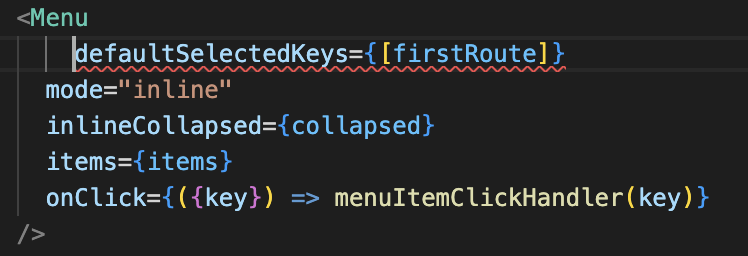

- react/no-deprecated 不使用弃用的方法
- react/self-closing-comp  jsx 自闭标签位置，没有 children 要使用自闭合标签

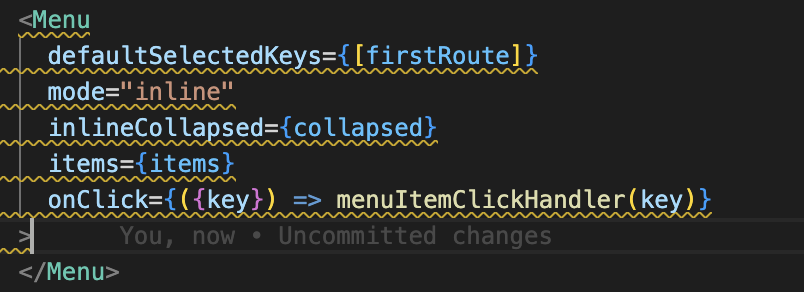

- react/jsx-closing-bracket-location 在JSX中验证右括号位置

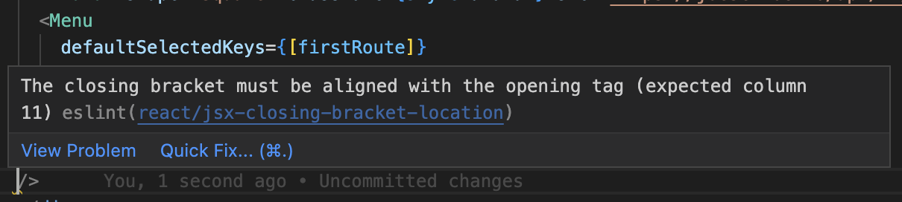

- react/jsx-indent JSX 缩进

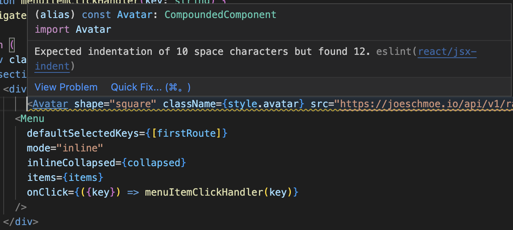
持续更新...
## Vetur
使用 vetur 插件格式化 vue 文件时，template 代码经常被格式化成预期之外的样式，如下
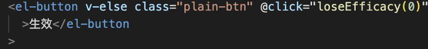
vetur 默认格式化 template 的插件是 prettier，需要改下 vscode 配置
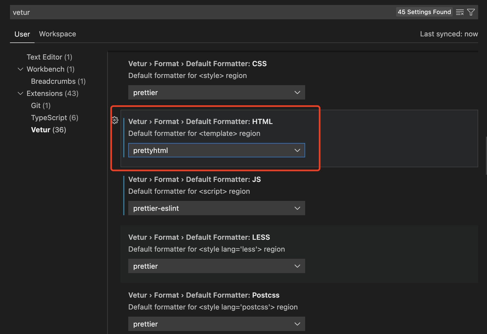


# 前端场景

## 开发中的广告处理

AdGuard 广告拦截器等 Chrome 插件内部的一个拦截规则是静态资源中含有 ad、adv、advertisement 等敏感字段，所以在开发中的静态资源应避免使用以上关于广告的字段的命名。


## 常用的几种跨域解决方案

同源: 如果两个 URL 的 protocol、主机名 host 和端口号 port 都相同的话，则这两个 URL 同源

**同源策略**<font style="color:#212121;">是一个重要的安全策略，它用于限制一个</font>[origin](https://developer.mozilla.org/zh-CN/docs/Glossary/Origin)<font style="color:#212121;">的文档或者它加载的脚本如何能与另一个源的资源进行交互。它能帮助阻隔恶意文档，减少可能被攻击的媒介。</font>

**造成跨域的几种常见表现**

+ 服务器分开部署（Web服务器 + 数据请求服务器）
+ 本地开发（本地开发项目请求测试服务器数据）
+ 调取第三方平台的接口


### 1. 修改本地 HOST

这里涉及 DNS 解析，具体情况如果不清楚的话请移步[#域名解析过程](#域名解析过程)


### 2. JSONP

> 原理： JSONP 利用 script 标签不存在域的限制，且定义一个 全局执行上下文 中的函数 func（用来接收服务器端返回的数据信息）来接收数据，从而实现跨域请求

**弊端：**

+ 只允许 GET 请求
+ 不安全，只要浏览器支持，且存在浏览器的全局变量里，则谁都可以调用
+ 需要后端配合

**图解 JSONP 的原理**
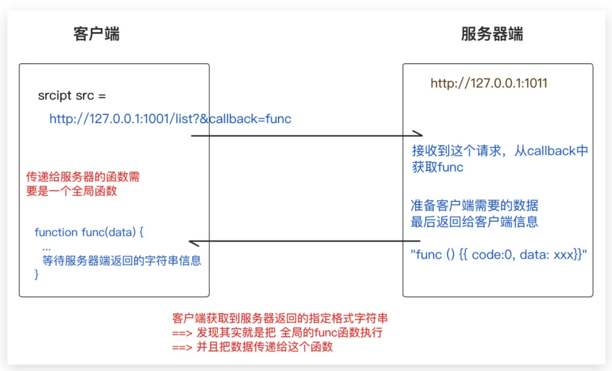

**手写 JSONP**
callback必须是一个全局上下文中的函数（防止不是全局的函数，我们需要把这个函数放在全局上，并且从服务器端接收回信息时，要浏览器执行该函数）

uniqueName 要确保唯一性

**client**

```javascript
function jsonp(url, callback) {
    // 把传递的回调函数挂载到全局上
    let uniqueName = `jsonp${new Date().getTime()}`;
     // 套了一层 anonymous function
    // 目的让 返回的callback执行且删除创建的标签
    window[uniqueName] = data => {
        document.body.removeChild(script)
        delete window[uniqueName];
        callback && callback(data);
    }
    
    // 处理URL
    url += `${url.includes('?') ? '&' : '?'}callback=${uniqueName}`;
    
    // 发送请求
    let script = document.createElement('script');
    script.src = url;
    document.body.appendChild(script);
}

jsonp('http://localhost:3000/list?userName=lm', res => {
    console.log(res)
})
```

**server**

```javascript
app.use('/list', (req,res) => {
    console.log(req.query)
    let { callback } = req.query;
  
  // 准备返回的数据（字符串）
  let result = { code: 0, data: [10,20] };
  let str = `${callback}(${JSON.stringify(result)})`;
  
  // 返回给客户端数据
  res.send(str);
})
```


### 3. CORS

不允许跨域的根本原因是因为`Access-Control-Allow-Origin`已被禁止，那么只要让服务器端设置允许源就可以了

```javascript
// 服务器端
app.use((req, res, next) => {
 // * 允许所有源（不安全/不能携带资源凭证）
 res.header("Access-Control-Allow-Origin", "*");
 res.header("Access-Control-Allow-Credentials", true);

 /* res.header("Access-Control-Allow-Headers", "Content-Type,....");
 res.header("Access-Control-Allow-Methods", "GET,..."); */

 // 试探请求：在CORS跨域请求中，首先浏览器会自己发送一个试探请求，验证是否可以和服务器跨域通信，服务器返回200，则浏览器继续发送真实的请求
 req.method === 'OPTIONS' ? res.send('CURRENT SERVICES SUPPORT CROSS DOMAIN REQUESTS!') : next();
});

// 客户端
let xhr = new XMLHttpRequest;
xhr.open('get', 'http://127.0.0.1:1001/list');
xhr.setRequestHeader('Cookie', 'name=jason');
xhr.withCredentials = true;
xhr.onreadystatechange = () => {
  if (xhr.status === 200 && xhr.readyState === 4) {
    console.log(xhr.responseText);
  }
};
xhr.send();
```

当我们一旦在服务器端设置了允许任何源可以请求之后，其实请求是不安全的，并且要求客户端不能携带资源凭证（比如上文中的Cookie字段），浏览器端会报错。

告诉我们Cookie字段是不安全的也不能被设置的，如果允许源为'*'的话也是不允许的。

<font style="color:#4A4A4A;">CORS的好处</font>

+ 原理简单，容易配置，允许携带资源凭证
+ 仍可以用 `ajax`作为资源请求的方式
+ 可以动态设置多个源，通过判断，将`Allow-Origin`设置为当前源

<font style="color:#4A4A4A;">CORS的局限性</font>

+ 只允许某一个源发起请求
+ 如多个源，还需要动态判断


### 4. Proxy

**Proxy**翻译为“代理”，是由webpack配置的一个插件，叫"webpack-dev-server"（只能在开发环境中使用）

**Proxy**在webpack中的配置: 

```javascript
const path = require('path');
const HtmlWebpackPlugin = require('html-webpack-plugin');

module.exports = {
  mode: 'production',
  entry: './src/main.js',
  output: {...},
  devServer: {
    port: '3000',
    compress: true,
    open: true,
    hot: true,
    proxy: {
      '/': {
        target: 'http://127.0.0.1:3001',
        changeOrigin: true
      }
    }
  },
  // 配置WEBPACK的插件
  plugins: [
    new HtmlWebpackPlugin({
      template: `./public/index.html`,
      filename: `index.html`
    })
  ]
};
```

<font style="color:#4A4A4A;">图解Proxy的原理</font>


**Proxy**代理其实相当于由`webpack-dev-server`配置在本地创建了一个port=3000的服务，利用`node`的中间层代理（分发）解决了浏览器的同源策略限制。

但是它只能在**开发环境**下使用，因为`dev-server`只是一个`webpack`的一个插件；

如果需要在生产环境下使用，需要我们配置`Nginx`反向代理服务器；

另外如果是自己实现`node服务层代理`：无论是开发环境还是生产环境都可以处理（node中间层和客户端是同源，中间层帮助我们向服务器请求数据，再把数据返回给客户端）

<font style="color:#4A4A4A;">Proxy的局限性</font>
只能在本地开发阶段使用


<font style="color:#3F3F3F;">配置Nginx反向代理</font>
主要作为**生产环境**下跨域的解决方案。

原理：利用Node中间层的分发机制，将请求的URL转向服务器端的地址

配置反向代理

```json
server {
 listen: 80;
  server_name: 192.168.161.189;
  loaction: {
  proxy_pass http://127.0.0.1:1001; // 请求转向这个URL地址，服务器地址
    root html;
    index index.html;
  }
}
```


<font style="color:#3F3F3F;">POST MESSAGE</font>
假设现在有两个页面，分别为A页面`port=1001`、B页面`port=1002`，实现页面A与页面B的页面通信（跨域）

原理：

+ 把 B页面当做A的子页面嵌入到A页面里，通过`iframe.contentWindow.postMessage`向B页面传递某些信息
+ 在A页面中通过`window.onmessage`获取A页面传递过来的信息`ev.data`(见下代码)
+ 同理在B页面中通过`ev.source.postMessage`向A页面传递信息
+ 在A页面中通过`window.onmessage`获取B页面传递的信息

主要利用内置的`postMessage`和`onmessage`传递信息和接收信息。

A.html

```html
// 把 B页面当做A的子页面嵌入到A页面里
<iframe id="iframe" src="http://127.0.0.1:1002/B.html" frameborder="0" style="display: none;"></iframe>
<script>
  iframe.onload = function () {
    iframe.contentWindow.postMessage('珠峰培训', 'http://127.0.0.1:1002/');
  }
  //=>监听B传递的信息
  window.onmessage = function (ev) {
    console.log(ev.data);
  }
</script>
```

B.html

```html
<script>
  //=>监听A发送过来的信息
  window.onmessage = function (ev) {
    // console.log(ev.data);
    //=>ev.source:A
    ev.source.postMessage(ev.data + '@@@', '*');
  }
</script>
```


## 前端关闭浏览器自动翻译功能

前端显示用户的英文username，浏览器如果开启了自动翻译功能可能会显示与中文名不符，引起用户歧义

```html
<html lang="en" translate="no">
```


## 从Performance看浏览器渲染流程

在国内搜索浏览器渲染流程相关概念结论大同小异，深入原理的文章更是少的可怜。我从几个线上常见的现象出发，结合自己写的一些 demo 来反推浏览器渲染相关原理，如果你认为哪里有问题或者有任何建议欢迎来找我探讨。


### 资源在浏览器中的生命周期

看其他人博客都会提到下面几个概念，看着看着就晕了，所以我们先来搞清楚这几个概念

**加载 - load**

资源从服务端请求到本地的过程

**解析 - parse**

Parser is that phase of compiler which takes token string as input and with the help of existing grammar, converts it into the corresponding parse tree. Parser is alse known as Syntax Analyzer.

**评估，计算 - evaluate**

Load the code into memory.

**执行 - execute**

发生在 evaluate 之后


### 前端资源加载流程

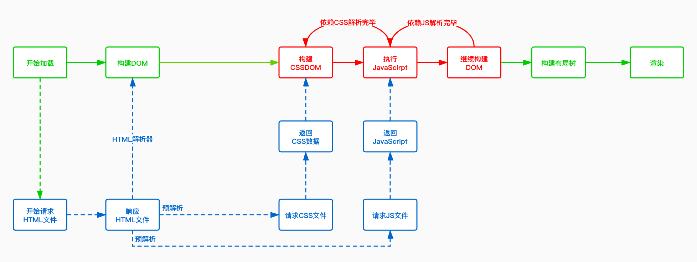

上图是浏览器解析资源的理想模型，实际上浏览器为了加载还进行了很多复杂的处理，下面一点点的分析

#### \<script>的执行 依赖它上面的CSS加载

或者说 css 的加载 会阻塞 \<script> 的执行

```javascript
// server.js
app.get("/a.js", (req, res) => {
  setTimeout(() => {
    res.sendFile(path.resolve("./a.js"));
  }, 2000);
});

app.get("/a.css", (req, res) => {
    setTimeout(() => {
      res.sendFile(path.resolve("./a.css"));
    }, 4000)
});
<!-- index.html -->
<head>
  <meta charset="UTF-8" />
  <meta http-equiv="X-UA-Compatible" content="IE=edge" />
  <meta name="viewport" content="width=device-width, initial-scale=1.0" />
  <title>Document</title>
  <link rel="stylesheet" href="/a.css" />
</head>
<body>
  我是测试
  <script src="/a.js"></script>
</body>
// a.js
console.log('a');
// a.css
body {
    height: 100px;
    background-color: red;
}
```

现象：*浏览器在 4s 后出来* 我是测试 、 红色背景以及控制台的打印 a，Network中，a.js的加载在 2s 后完成

从现象得出： **css 的加载会阻塞 js 的运行**。我猜测 js 可能会去获取或改变元素的样式，浏览器为了不重复渲染会等待所有的 css 加载渲染完成后再执行 js。从 a.js 加载在 2s 时完成可以得出结论：**同步资源的加载不会受其他资源的加载或者位置的影响**， a.js a.css 在 html 的位置不同，加载时间也不同，但是在浏览器中却是接近于并发请求的资源。查阅资料发现：浏览器在得到 html 文件之后会对整个文件进行预扫描，将 html 文件所依赖的资源同时请求加载。


#### \<script>标签会阻塞 DOM 解析和渲染

<script> 的 加载、解析和执行都会阻塞 DOM 的解析和渲染。从客观分析是： js 可以操作 DOM，浏览器为了防止渲染过程出现不可预期的结果，让 GUI 渲染线程和 JS 引擎线程互斥，即解析器在遇到 <script> 标记会立即加载、解析执行脚本，文档的解析将停止，直到脚本执行完毕

```html
<html>
<head>
    <tilte>title</title>
</head>
<body>
    <!-- 不管inline或引入的script获取此标签之后的元素是获取不到的 -->
    <script>
        let div = document.querySelector('div');
        console.log(div); // null
    </script>
    <div>
        i am content.
    </div>
</body>
</html>
```

渲染在 DOM 解析之后，毋庸置疑也会阻塞页面的渲染。


#### 外链 \<script> 会触发页面的 Paint

学习前端基础的时候，总是有人告诉我要将 \<script> 标签写在最下面，这里浏览器做了些什么优化呢？

```html
<!-- index.html -->
<body>
    我是外链 script 上面的内容
    <!-- a.js 同步执行时间较长 大概4s -->
    <script src="/a.js"></script>
    我是外链 script 下面的内容
</body>
// a.js
console.log(new Date().getTime());
for (let i = 0; i < 5000000000; i++) {
  let a = i;
}
console.log(new Date().getTime());
```

现象：*页面上一开始就会出现* 我是外链 script 上面的内容，过了大概 4s 后出现 我是外链 script 下面的内容

虽然 \<script> 会阻塞页面的渲染，但也不是非要等到 所有的 js 加载执行完才渲染，否则用户等待时间太长了。浏览器的设计肯定会让用户尽早看到页面，所以在遇到 \<script> 标签时，会触发一次 Paint，**将 \<script> 标签之前的元素渲染出来**

但也不是所有的 \<script> 会触发 Paint。

**\<head> 中的 \<script> 不会触发 Paint**

此时 \<body> 还没有解析，触发绘制也看不到任何内容

**任何位置 inline 的 \<script> 也不会触发 Paint**

```html
<!-- index.html -->
<body>
  我是inline script 上面的内容
  <!-- a.js 同步执行时间较长 大概4s -->
  <script>
    console.log(new Date().getTime());
    for (let i = 0; i < 5000000000; i++) {
      let a = i;
    }
    console.log(new Date().getTime());
  </script>
  我是inline script 下面的内容
</body>
<!-- index.html -->
<body>
  我是inline script 上面的内容
</body>
</html>
<script>
  console.log(new Date().getTime());
  for (let i = 0; i < 5000000000; i++) {
    let a = i;
  }
  console.log(new Date().getTime());
</script>
```

浏览器等待大概 **4s** 之后浏览器才会渲染出内容，无论他在何处


#### \<link> 标签不会阻塞 DOM 解析但会阻塞 DOM 渲染

DOM的解析和CSSOM的解析是一个并行的过程。两者互不影响。两者解析完成之后，会合并生成render tree，之后就是layout和paint阶段，渲染到页面中。

```html
<!-- index.html -->
<html>
  <head>
    <title>title</title>
    <script>
      setTimeout(() => {
        console.log(document.querySelectorAll("div"));
      }, 1000);
      document.addEventListener("DOMContentLoaded", () => {
        console.log("dom parse done");
      });
    </script>
    <link rel="stylesheet" href="/a.css" />
  </head>
  <body>
    <div>i am content a.</div>
    <div>i am content b.</div>
  </body>
</html>
```

结果如下图


页面未渲染出 div 之前能够打印出 该值。<link> 标签不会像 <script> 标签一样触发页面绘制，浏览器时并行解析生成 DOM Tree 和 CSSOM Tree，当两者都解析完成才会生成 render tree，页面才会渲染，所以应尽量减少首屏样式文件大小，提高首屏展示速度。


### 浏览器性能指标

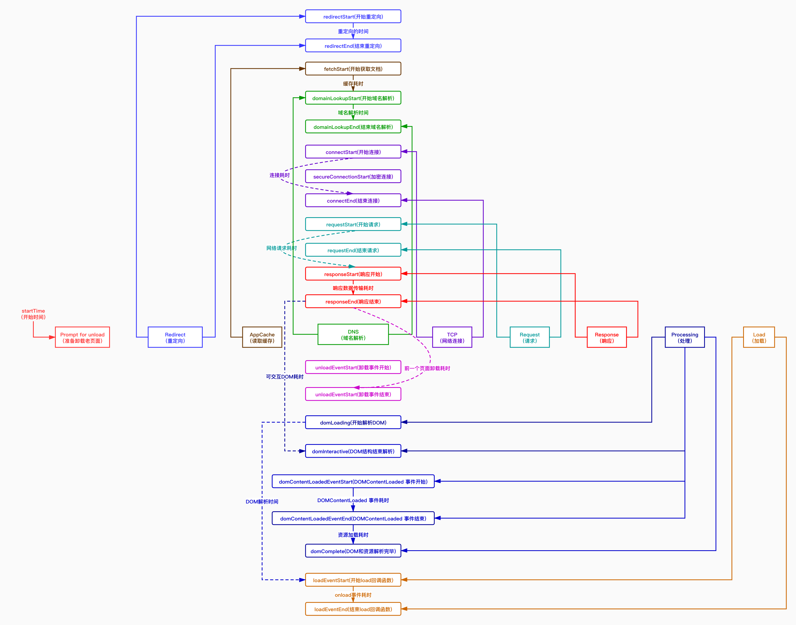

上图是 浏览器 performance API，将这些 API 相减就能得出反映浏览器的性能指标

#### FP(First Paint)

浏览器第一次渲染，在 FP 之前都是白屏，在有外链 <script> 的文档中为 第一次 Paint 的时间。


#### DCL(domContentLoaded)

The DOMContentLoaded event fires when the initial HTML document has been completely loaded and parsed, without waiting for stylesheets, images, and subframes to finish loading. ——MDN

**DCL事件发生在整个 DOM 解析完成，不会等待样式表、图片和子框架的加载**

这里没有提 JS 的问题，这个可以从上面的结论推断出来。DOM 在解析时碰到 <script> 标签会停止解析，当 DOM 解析完成之后，<script> 已经完成了执行。整体前端资源加载流程就是 **DOM 解析依赖 <script> ，<script> 的执行依赖 <link>**。


**DCL 事件的意义**

domContentLoadedEventStart 发生在 domInteractive(DOM 结构结束解析)，此时*文档中的同步 js 以及附带的 微任务 都已经执行完成*，可以拿到 DOM 节点做一些操作，如

```javascript
document.addEventListener('DOMContentLoaded', function(){})。
```

domContentLoadedEventEnd 发生时浏览器会去检查线程中是否存在加载中的资源，如果有的话就去加载，这些资源加载完成才会 domComplete(DOM 和资源解析完毕)，**如果在同步 js 执行中的异步资源任务等待时间小于它后面 同步 js 的执行时间，那么这个异步资源也会被记录到资源加载耗时。**


**DCL 有时会等待样式表的加载**

我们先来看存在 \<link> 标签和 \<script> 标签的情况(一个4s、一个2s)，performace 面板如下

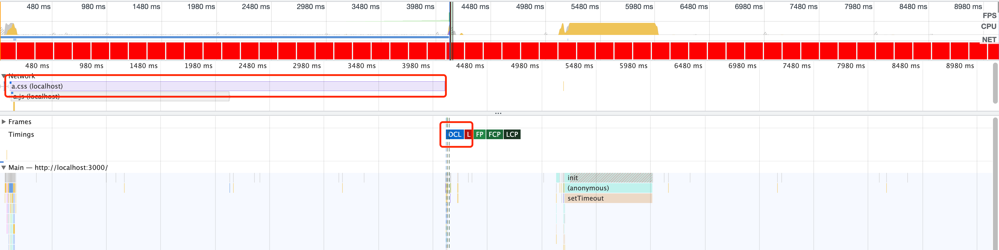

可以看出，DCL 事件发生在了 css样式表完全加载之后

DOMContentLoaded doesn’t wait for stylesheets to load *provided that* no scripts are placed after the stylesheet reference, \<link rel="stylesheet">. This is valid for all browsers supporting DOMContentLoaded. —— [molily](https://molily.de/)[DOMContentLoaded and stylesheets](https://molily.de/domcontentloaded/)

所以我尝试了一下 \<link> 标签下没有 \<script>，performance 面板如下

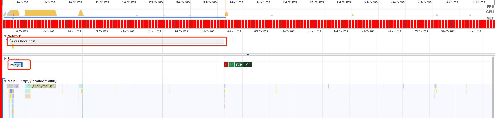

所以得出结论：**MDN 上的不会等待样式表指的是 此样式表下没有任何脚本的情况**

这也佐证了 *\<link> 标签是不会阻塞 DOM 解析但会阻塞 DOM 渲染*。浏览器遇到 \<link> 标签就加载，同时解析 DOM，DOM 解析完成，DCL 触发，此时页面中并没有内容，直到 CSS 加载完成之后生成 CSSOM 与 DOM 结合生成 render tree，页面中出现内容。如果存在了 \<script> 标签了呢？*\<script> 标签会阻塞 DOM 解析*，\<script> 执行又依赖 css 的加载，所以只能等到 css 加载完成，js执行了，DOM 才能解析完成。


#### L(loadEvent)

Load event gets completed once all the components i.e. DOM hierarchy along with associated features of a webpage such as CSS files, JavaScript files, images/pictures, and external links are loaded. So basically, the load event helps in knowing when the page has fully-loaded.

**loadEventStart 事件开始是所有资源完成加载的时间**

loadEventEnd 事件在 onLoad 的同步代码执行完成后会触发，在 onLoad 中代码执行时间太长也是会影响指标。

```html
<!-- index.html -->
<html>
  <head>
    <title>title</title>
  </head>
  <body>
    <div>i am content a.</div>
    <div>i am content b.</div>
  </body>
</html>
<script src="/a.js"></script>
// a.js
function onLoad(cb) {
  if (document.readyState === "complete") {
    cb();
  } else {
    window.addEventListener("load", cb);
  }
}
onLoad(() => {
  console.log(new Date().getTime());
  for (let i = 0; i < 5000000000; i++) {
    let a = i;
  }
  console.log(new Date().getTime());
});
```

上述代码的 performance 面板如下

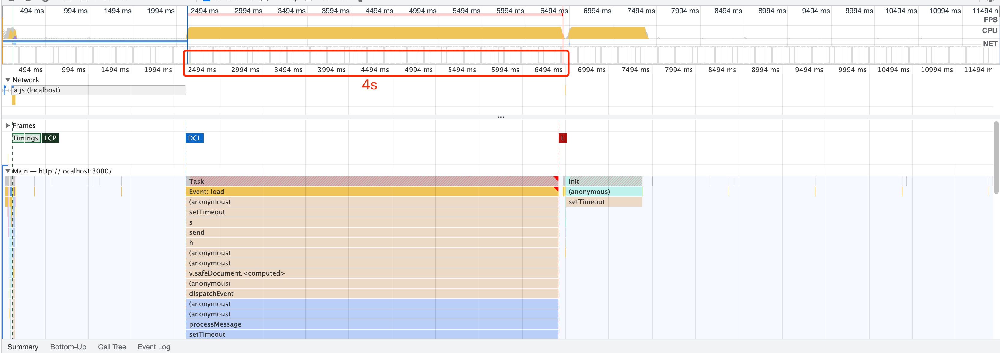


### 结论

#### 资源数据指标和用户视觉感知并不对等

如果异步资源特别大，但同步 js 执行时间大于异步资源开始加载时间，此时的 「资源加载时间」就会很长，用户却早早就可以操作了。

如果

我们应该减少第一次同步 js 的执行时间来尽量避免这个问题，比如减少首屏 DOM 的挂载、尽量避免 长列表for循环和递归等等

#### 提升网站速度方法

- 减少首屏 css 和 js 加载时间(可以通过 Webpack 分包、路由懒加载、资源压缩等等方式)
- 减少首屏 js 的同步执行时间(主要是 for 循环阻塞线程)

将 CSS 放在文件头部，JavaScript 文件放在底部

- 如果 css 放在文件中部或者底部，遇到 \<link> 标签渲染无样式的页面，加载完 css 又重新渲染有样式的页面，浏览器会两次渲染。同时用户在第一次感知是"丑陋的"。Javascript 放在底部可以让用户先看到页面，避免长时间白屏

#### 用户视觉层面的浏览器渲染

- 白屏：*加载 html* => *扫描 html 内容* => *将 css 与 js 同时加载* => *css 与 html 同时解析* => *遇到外链 \<script>*
- 预渲染/默认内容：*遇到外链 \<script> 触发绘制* => *解析执行js* => *初始化并调用实例* => 初始化数据生成虚拟 DOM 
- Loading/无数据页面：*调用 render 重新构建DOM并渲染* => *向后端请求数据*
- 最终页面：*数据到达前端并渲染*


## Script标签中的async和defer

script标签用于加载脚本与执行脚本，在前端开发中可以说是非常重要的标签了。

直接使用script脚本的话，html会按照顺序来加载并执行脚本，在脚本加载&执行的过程中，会阻塞后续的DOM渲染。


现在大家习惯于在页面中引用各种的第三方脚本，如果第三方服务商出现了一些小问题，比如延迟之类的，就会使得页面白屏。

好在script提供了两种方式来解决上述问题，async和defer，这两个属性使得script都不会阻塞DOM的渲染。

但既然会存在两个属性，那么就说明，这两个属性之间肯定是有差异的。


### 普通Script
文档解析的过程中，如果遇到script脚本，就会停止页面的解析进行下载（但是Chrome会做一个优化，如果遇到script脚本，会快速的查看后边有没有需要下载其他资源的，如果有的话，会先下载那些资源，然后再进行下载script所对应的资源，这样能够节省一部分下载的时间 ）。

资源的下载是在解析过程中进行的，虽说script1脚本会很快的加载完毕，但是他前边的script2并没有加载&执行，所以他只能处于一个挂起的状态，等待script2执行完毕后再执行。

当这两个脚本都执行完毕后，才会继续解析页面


### Defer
如果script标签设置了该属性，则浏览器会异步的下载该文件并且不会影响到后续DOM的渲染；

如果有多个设置了defer的script标签存在，则会按照顺序执行所有的script；

defer脚本会在文档渲染完毕后，DOMContentLoaded事件调用前执行。

文档解析时，遇到设置了defer的脚本，就会在后台进行下载，但是并不会阻止文档的渲染，当页面解析&渲染完毕后。

会等到所有的defer脚本加载完毕并按照顺序执行，执行完毕后会触发DOMContentLoaded事件。

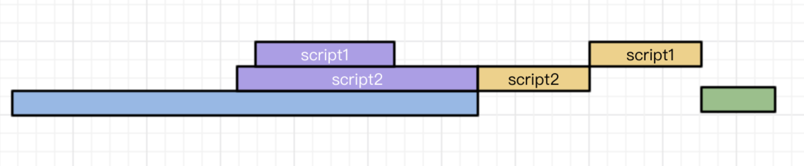


### Async
async的设置，会使得script脚本异步的加载并在允许的情况下执行

async的执行，并不会按着script在页面中的顺序来执行，而是谁先加载完谁执行。

async脚本会在加载完毕后执行。

async脚本的加载不计入DOMContentLoaded事件统计，也就是说下图两种情况都是有可能发生的

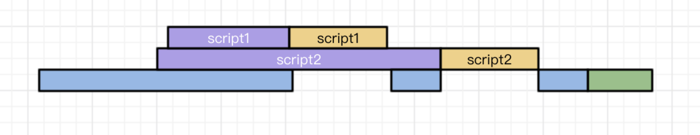

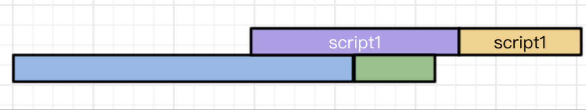

### 推荐的应用场景
#### defer
如果你的脚本代码依赖于页面中的DOM元素（文档是否解析完毕），或者被其他脚本文件依赖。

例：

+ 评论框
+ 代码语法高亮
+ polyfill.js

#### async
如果你的脚本并不关心页面中的DOM元素（文档是否解析完毕），并且也不会产生其他脚本需要的数据。

例：

+ 百度统计


## 实现一个可以任意扩展接口的服务器，且能上传文件和文件下载

### 探究原理

下面以文件上传为何需要使用 POST 请求、指定上传格式、后端如何接收等等展开


**为何是 POST 而不是 GET？**

由于客户端上传的文件大小是不确定的，所以 HTTP 协议规定，文件上传的数据要存放于请求正文中，而不能出现在 URL 的地址栏中，因为地址栏中可以存放的数据量太小(一般不超过2K)


**POST 请求主体类型？**

引入 MDN 上概念：

**HTTP** `**POST**` **方法** 发送数据给服务器. 请求主体的类型由 `Content-Type` 首部指定.

PUT 和`POST`方法的区别是,PUT方法是幂等的：连续调用一次或者多次的效果相同（无副作用）。连续调用同一个POST可能会带来额外的影响，比如多次提交订单。

一个 `POST` 请求通常是通过 [HTML 表单](https://developer.mozilla.org/en-US/docs/Learn/Forms)发送, 并返回服务器的修改结果. 在这种情况下, content type 是通过在 `<form>` 元素中设置正确的 `enctype` 属性, 或是在 `<input>` 和 `<button>` 元素中设置 `formenctype` 属性来选择的:

- `application/``x-www-form-urlencoded`: 数据被编码成以 `'&'` 分隔的键-值对, 同时以 `'='` 分隔键和值. 非字母或数字的字符会被 [percent-encoding](https://developer.mozilla.org/zh-CN/docs/Glossary/percent-encoding): 这也就是为什么这种类型不支持二进制数据(应使用 `multipart/form-data` 代替).
- `multipart/form-data`
- `text/plain`

当 POST 请求是通过除 HTML 表单之外的方式发送时, 例如使用 `XMLHttpRequest`, 那么请求主体可以是任何类型.

文件上传要求客户端表单提交特殊的请求——mutipart请求，即包含多部分数据的请求。所以文件上传表单对于表单数据的编码类型要求必须为 mutipart/form-data，即指定 form 表单的 enctype(encoding type)


使用默认的 `application/x-www-form-urlencoded` 做为 content type 的简单表单:

```json
POST / HTTP/1.1
Host: foo.com
Content-Type: application/x-www-form-urlencoded
Content-Length: 13

say=Hi&to=Mom
```

使用 `multipart/form-data` 作为 content type 的表单:

```json
POST /test.html HTTP/1.1
Host: example.org
Content-Type: multipart/form-data;boundary="boundary"

--boundary
Content-Disposition: form-data; name="field1"

value1
--boundary
Content-Disposition: form-data; name="field2"; filename="example.txt"

value2
```

**后端是如何接收到这些数据的？**

这里使用简易的 Express 搭建服务，如下：

```javascript
const express = require('express');
const path = require('path');

const app = express();

app.get('/', (req, res) => {
    res.sendFile(path.resolve('./public/index.html'))
})

app.post('/upload', (req, res) => {
    let str = ''
    req.on('data',chunk => {
        console.log(chunk)
        str += chunk
    })
    req.on('end', () => {
        res.send(str)
    })
})

app.listen(3000, () => {
    console.log('server is running at http://localhost:3000');
})
```

上述代码中有两个重要的变量—— chunk 和 str

chunk 为代码块，因为 POST 请求整体采用二进制流的方式发送数据，我们无法直接拿到，只能通过监听 req 请求体的 data 事件(数据开始流入时触发)和 end 事件(数据停止流入时触发)才可以获取到请求数据，chunk 代码块为 Buffer 格式数据：

```javascript
<Buffer 75 73 65 72 3d 7a 73 26 70 77 64 3d 31 32 33>
```

如果只需要获取文本信息，可以定义一个 str 将所有的 chunk 拼接起来

关于`multipart/form-data`也是大致一样的思路，只不过解析规则有些不同


### 文件上传方式

关于文件上传我这里大概有三个方式，第一个 form 表单上述已经大致解释明白了，因为这个方式基本被废弃，这里不再赘述


#### Base64

服务器: 接收到客户端传递的base64信息，把base64转换为具体的文件存储并返回客户端存储的文件地址


**前端**

ajax 方便后面代码的通用性，这里用原生 XMLHttpRequest 做一层简单的封装来发送请求

```javascript
// request.js
var request = ({
    url,
    method = "post",
    data,
    headers = {},
    requestList
}) => {
    return new Promise(resolve => {
        const xhr = new XMLHttpRequest();
        xhr.open(method, url);
        Object.keys(headers).forEach(key =>
            xhr.setRequestHeader(key, headers[key])
        );
        xhr.send(data);
        xhr.onload = e => {
            let data;
            try {
                data = JSON.parse(e.target.response)
            } catch (error) {
                data.e.target.response
            }
            resolve({
                data
            });
        };
    });
}
```

主要的上传逻辑

```html
<body>
    <input type="file" id="fileInp"><br/>
    
</body>
</html>
<script src="./request.js"></script>
<script>
    // 封装生成base64格式的方法
    function changeFile(file) {
        return new Promise((resolve, reject) => {
            let readFile = new FileReader()
            readFile.readAsDataURL(file)
            readFile.onload = ev => {
                resolve(ev.target.result)
            }
        })
    }
    fileInp.onchange = async function () {
        // 获取上传的文件对象
        const file = fileInp.files[0]
        // 生成 base64
        const result = await changeFile(file)
        // 将 base64 传给后端
        const res = await request({
            url: '/upload',
            method: 'post',
            headers: {
                "Content-Type": "application/x-www-form-urlencoded"
            },
            // 防止乱码
            data: `chunk=${encodeURIComponent(result)}&filename=${file.name}`
        })
        if (res.data.code === 0) {
            serverImg.src = res.data.path    
        }
    }
</script>
```


**后端**

考虑到文件名重复会对服务器文件存储造成一定影响，这里封装了一个 uglyFilename 来生成唯一文件名

```javascript
module.exports = (filename) => {
    // 最后一个点的在文件名的下标
    let dotIndex = filename.lastIndexOf('.'),
    // 文件名称
    name = filename.substring(0,dotIndex),
    // 文件后缀
    suffix = filename.substring(dotIndex+1);
    // md5加密文件名称并且加入时间戳实现唯一值
    name = require('crypto').createHash('md5').update(name).digest('hex')+new Date().getTime()
    // 返回加密后的文件名
    return `${name}.${suffix}`
}
```

413 Request Entity Too Large

上传数据时，报了一个 413 的错误，查了资料是因为 nginx 或者服务器对文件传输大小有限制，我这里没有使用 nginx，所以在解析 POST 请求体数据的部分加了个 limit 配置

```javascript
app.use(express.json()); // 解析json数据
app.use(express.urlencoded({extended: true, limit: '50mb'})); // 解析表单数据
```

上传接口

```javascript
app.post('/upload', (req, res) => {
    const {
        chunk,
        filename
    } = req.body;
    // md5加密无序化文件名
    let uglyFilename = uglifyFilename(filename)
    // 文件存储路径
    const chunkPath = path.join('./public', uglyFilename)
    // 正则替换声明头
    chunk = decodeURIComponent(chunk).replace(/^data:image\/\w+;base64,/, '')
    // 将base64转成buffer数据
    chunk = Buffer.from(chunk, 'base64')
    // 将buffer数据写入文件
    fs.writeFileSync(chunkPath, chunk)
    res.send({
        code: 0,
        msg: '上传成功',
        path: `http://localhost:3000/${uglyFilename}`
    })
})
```

从上面可以看出，这种转成 base64 的方式，对于图片上传还可以，对于其他文件的上传就无意义了


#### FormData

服务器: 接收到客户端传递的文件信息，创建文件并返回客户端存储的文件地址


**前端**

思路和上面 Base64 相差不大，加了一些常用的限制

```html
<body>
    <!-- 非图片类型的文件变灰无法被点击 -->
    <input type="file" id="fileInp" accept="image/*">
    <br>
    
</body>
</html>
<script src="./request.js"></script>
<script>
    const limitType = ['image/jpeg', 'image/jpg', 'image/png', 'image/gif']
    const limitMax = 100 * 1024;
    // 监听文件输入框的变化
    fileInp.onchange = async function () {
        // 获取文件对象
        let file = fileInp.files[0];
        // 排除上传非文件
        if (!file) return;
        // 限制上传类型mime type
        if (!limitType.includes(file.type)) {
            alert('不支持的上传格式！')
            fileInp.value = '';
            return
        }
        // 限制上传大小
        if (file.size > limitMax) {
            alert('最大只能上传100KB')
            fileInp.value = '';
            return
        }
        // 通过FormData类创建一个空对象
        let formData = new FormData()
        // 默认Content-Type: multipart/form-data
        // 通过append()方法来追加数据
        formData.append('chunk', file);
        console.log(formData)
        // 发送文件信息
        let res = await request({
            url: '/upload',
            method: 'POST',
            data: formData
        })
        if (res.data.code === 0) {
            serverImg.src = res.data.path
        }
    }
</script>
```


**后端**

- 这里回顾下上面的 content-type 为`multipart/form-data`发送到服务端的数据格式：

```javascript
------WebKitFormBoundaryL5AGcit70yhKB92Y
Content-Disposition: form-data; name="username"

lee
------WebKitFormBoundaryL5AGcit70yhKB92Y
Content-Disposition: form-data; name="password"

123456
Content-Disposition: form-data; name="file"; filename="upload.txt"
Content-Type: text/plain

upload
------WebKitFormBoundaryL5AGcit70yhKB92Y--
```

- 分析

1. 表单上传的数据，被分隔符"------WebKitFormBoundaryL5AGcit70yhKB92Y"隔开，分隔符在每次上传时都不同。分隔符数据可以从 `req.headers['content-type']` 中获取，如：

```javascript
const contentType = req.headers['content-type']; // multipart/form-data; boundary=----WebKitFormBoundaryL5AGcit70yhKB92Y
const boundary = '--' + contentType.split('; ')[1].split('=')[1] // ------WebKitFormBoundaryL5AGcit70yhKB92Y
```

1. 前两段数据中，分别可以获取到表单上传的字段名name="username"，以及数据"lee"
2. 第三段数据中，多了一个字段filename="upload.txt"，它表示的是文件的原始名称，以及可以获取到文件类型"Content-Type:text/plain"，表示这是一个文本文件，最后是文件的内容"upload"

由此可以看出，文件上传数据虽然有些乱，但还是有规律的，那么处理思路就是按照规律，将数据切割之后，取出其中有用的部分


- 上传数据结构分析

将上面数据的回车符标记出来：

```javascript
------WebKitFormBoundaryL5AGcit70yhKB92Y\r\n
Content-Disposition: form-data; name="username"\r\n
\r\n
lee\r\n
------WebKitFormBoundaryL5AGcit70yhKB92Y\r\n
Content-Disposition: form-data; name="password"\r\n
\r\n
123456\r\n
Content-Disposition: form-data; name="file"; filename="upload.txt"\r\n
Content-Type: text/plain\r\n
\r\n
upload\r\n
------WebKitFormBoundaryL5AGcit70yhKB92Y--
```

可以看出，每段数据的结构是这样的：

```javascript
------WebKitFormBoundaryL5AGcit70yhKB92Y\r\nContent-Disposition: form-data; name="username"\r\n\r\nlee\r\n
```

将每段上传数据简化如下：

```javascript
<分隔符>\r\n字段头\r\n\r\n内容\r\n
```

也就是说，整个表单的数据，就是按照这样的数据格式组装而成

需要注意的是，在表单数据的结尾不再是\r\n，而是"--"


- 上传数据处理步骤

1. 用分隔符切分数据

```json
[
  ‘’,
  "\r\n字段信息\r\n\r\n内容\r\n",
  "\r\n字段信息\r\n\r\n内容\r\n",
  "\r\n字段信息\r\n\r\n内容\r\n",
  '--'
]
```

1. 删除数组头尾数据：

```json
[
  "\r\n字段信息\r\n\r\n内容\r\n",
  "\r\n字段信息\r\n\r\n内容\r\n",
  "\r\n字段信息\r\n\r\n内容\r\n",
]
```

1. 将每一项数据头尾的的\r\n删除：

```json
[
  "字段信息\r\n\r\n内容",
  "字段信息\r\n\r\n内容",
  "字段信息\r\n\r\n内容",
]
```

1. 将每一项数据中间的\r\n\r\n删除，得到最终结果：

```json
[
	"字段信息", "内容",
	"字段信息", "内容",
	"字段信息", "内容",
]
```


- Buffer 数据处理

由于文件都是二进制数据，不能直接将其转换为字符串后再进行处理，否则数据会出错，因此要通过Buffer模块进行数据处理操作

Buffer模块提供了indexOf方法获取Buffer数据中，其参数所在位置的index值

Buffer模块提供了slice方法，可通过index值切分Buffer数据

测试Buffer

```javascript
const buffer = Buffer.from('lee\r\nchen\r\ntest')
const index = buffer.indexOf('\r\n')
console.log(index) // 3
console.log(buffer.slice(0, index).toString()) // 'lee'
```

由此可以封装一个专门用于切割Buffer数据的方法：

```javascript
module.exports = function bufferSplit(buffer, separator) {
  let result = [];
  let index = 0;

  while ((index = buffer.indexOf(separator)) != -1) {
    result.push(buffer.slice(0, index));
    buffer = buffer.slice(index + separator.length);
  }
  result.push(buffer);

  return result;
}
```

- 文件上传数据处理

show code!

```javascript
app.post('/upload', async (req, res) => {
    const contentType = req.headers['content-type']
    const boundary = '--' + contentType.split('; ')[1].split('=')[1]
    const arr = [];
    const buffer = await new Promise(resolve => {
        req.on('data', chunk => {
            arr.push(chunk)
        })
        req.on('end', () => {
            resolve(Buffer.concat(arr))
        })
    })
    console.log(buffer.toString())

    // 1. 用<分隔符>切分数据
    let result = bufferSplit(buffer, boundary)
    console.log(result.map(item => item.toString()))

    // 2. 删除数组头尾数据
    result.pop()
    result.shift()
    console.log(result.map(item => item.toString()))

    // 3. 将每一项数据中间的\r\n\r\n删除，得到最终结果
    result = result.map(item => item.slice(2, item.length - 2))
    console.log(result.map(item => item.toString()))

    // 4. 将每一项数据中间的\r\n\r\n删除，得到最终结果
    result.forEach(item => {
        let [info, data] = bufferSplit(item, '\r\n\r\n')

        // info为字段信息，这是字符串类型数据，直接转换成字符串，若为文件信息，则数据中含有一个回车符\r\n，可以据此判断数据为文件还是为普通数据
        info = info.toString()

        // 若为文件信息，则将Buffer转为文件保存
        if (info.indexOf('\r\n') >=0) {
            // 获取字段名 name=file
            let infoResult = info.split('\r\n')[0].split('; ')
            let name = infoResult[1].split('=')[1]
            name = name.substring(1, name.length - 1)
            // 获取文件名 filename="upload.txt"
            let filename = infoResult[2].split('=')[1]
            filename = filename.substring(1, filename.length - 1)
            console.log(name)
            console.log(filename)
            // 将文件存储到服务器
            fs.writeFileSync(path.resolve(`./public/${filename}`), data)
        } else {
            // 若为数据，则直接获取字段名称和值
            let name = info.split('; ')[1].split('=')[1]
            name = name.substring(1, name.length - 1)
            const value = data.toString()
            console.log(name, value, '#####')
        }
    })
})
```

- 使用第三方库——multiparty

虽然我们完成了完整的文件上传流程，但是实际工作中不可能自己从头开发所有功能，效率低并且通用型差

下面的代码可以测试下multiparty的功能

它会在field事件中，将数据信息的字段名和值返回，在file事件中，将文件的字段名和信息返回

上传成功后，会在指定的文件夹创建一个上传的文件，并会将文件重命名（如：IqUHkFe0u2h2TsiBztjKxoBR.jpg），以防止重名

若上传出现失败，已保存的文件会自动删除

close事件表示表单数据全部解析完成，用户可以在其中处理已经接收到的信息

不过我在使用中发现这个指定文件夹好像不可以配置，我还得将目标文件拷贝一份到我指定目录并删除源文件

示例代码

```javascript
const form = new multiparty.Form({
  uploadDir: './upload' // 指定文件存储目录
})
form.parse(req) // 将请求参数传入，multiparty会进行相应处理

form.on('field', (name, value) => { // 接收到数据参数时，触发field事件
  console.log(name, value)
 })

form.on('file', (name, file, ...rest) => { // 接收到文件参数时，触发file事件
  console.log(name, file)
})

form.on('close', () => {  // 表单数据解析完成，触发close事件
  console.log('表单数据解析完成')
})
```

实际项目中使用

```javascript
app.post('/upload2', (req, res) => {
    // 实例化Form
    let form = new multiparty.Form()
    // 设置单文件大小限制
    // form.maxFilesSize = 2 * 1024 * 1024;
    // 解析二进制流
    form.parse(req, function (err, fields, file) {
        // 处理错误
        if (err) {
            res.send({
                code: 1,
                err
            })
            return
        }
        // 得到上传文件信息
        const chunk = file.chunk[0]
        // md5加密无序化文件名
        let uglyFilename = uglifyFilename(chunk.originalFilename)
        // 文件的存放目录
        const chunkPath = path.join('./public', uglyFilename)
        // 创建读取临时缓存区的文件流
        let rs = fs.createReadStream(chunk.path)
        let ws = fs.createWriteStream(chunkPath)
        rs.pipe(ws)
        // 读取结束，删除缓存区文件，提高性能
        rs.on('end', () => {
            fs.unlinkSync(chunk.path)
        })
        res.send({
            code: 0,
            msg: '上传成功',
            path: `http://localhost:3000/${uglyFilename}`
        })
    })
})
```


### 切片上传

HTTP可以并发传递**6—7**个请求


#### 切片上传步骤

1. 把大文件切片化（5个）
   file是Blob的实例，Blob.prototype.silce可以把一个文件切片处理


1. 同时并发五个切片的上传请求
   /chunk 处理每一个切片的请求
    chunk：文件切片
    filename：切片的名字 ->文件名-索引.后缀
   upload目录下创建一个以文件名命名的临时目录，把切片存储到这个目录下
    xxxxx
    xxxxx-0-png
    xxxxx-1-png
    ....


1. 等5个切片都上传完，再向服务器发送一个合并切片的请求
   /merge 合并
    filename：文件名 文件名.后缀
   根据文件名找到之前存储的临时目录，按顺序读取目录中的切片信息，把每一个切片信息合并起来（合并完记得删除临时目录和里面的切片即可）


#### 上传进度条

这里规定了一定会发送五个切片请求，所以给每一个请求*20即可，最终将所有数据存入数组

监听进度的变化使用的 ajax 的 `upload.onprogress` 方法

监听每个 item 进度变化使用的是 Proxy

```javascript
// 实例代理器修改进度
let _data = new Proxy([], {
    set(target, key, value) {
        target[key] = value;
        let sum = _data.reduce((prev, next) => {
            return prev + next
        }, 0)
        if (sum >= 100) {
            progress.innerHTML = '上传完成'
            return
        }
        progress.innerHTML = `${sum}%`
    }
})
```


#### 前端代码

```javascript
<body>
    <input type="file" id="fileInp"><span id="progress">0%</span>
    <br>
    
</body>

</html>
<script src="./request.js"></script>
<script>
    // 封装格式化文件名方法
    function formatFilename(filename, i) {
        // 最后一个点的在文件名的下标
        let dotIndex = filename.lastIndexOf('.'),
            // 文件名称
            name = filename.substring(0, dotIndex),
            // 文件后缀
            suffix = filename.substring(dotIndex + 1);
        name = `${name}-${i}`
        // 返回加密后的文件名
        return `${name}.${suffix}`
    }
    // 实例代理器修改进度
    let _data = new Proxy([], {
        set(target, key, value) {
            target[key] = value;
            let sum = _data.reduce((prev, next) => {
                return prev + next
            }, 0)
            if (sum >= 100) {
                progress.innerHTML = '上传完成'
                return
            }
            progress.innerHTML = `${sum}%`
        }
    })
    // 监听文件输入框的变化
    fileInp.onchange = async function () {
        // 获取文件对象
        let file = fileInp.files[0];
        // 把一个文件切成五个切片（固定切片数量，也可以固定切片大小）
        let partSize = file.size / 5;
        let cur = 0; // 当前的文件大小
        let i = 0; // 当前切片的索引
        let partList = []; //存放切片的数组

        while (i < 5) {
            partList.push({
                chunk: file.slice(cur, cur + partSize),
                filename: formatFilename(file.name, i)
            });
            cur += partSize;
            i++;
        }
        // 并发切片请求
        partList = partList.map(async (item, index) => {
            let formData = new FormData()
            formData.append('chunk', item.chunk);
            formData.append('filename', item.filename);
            let res = await request({
                url: '/chunk',
                method: 'POST',
                data: formData,
                onProgress: ev => {
                    _data[index] = Math.round(ev.loaded / ev.total * 20)
                }
            })
            if (res.data.code !== 0) return Promise.reject(res)
            return Promise.resolve(res)
        })
        // 合并切片
        await Promise.all(partList);
        // 发送合并切片请求
        let mergeRes = await request({
            url: '/merge',
            method: 'POST',
            headers: {
                "Content-Type": "application/json"
            },
            data: JSON.stringify({
                filename: file.name
            })
        })
        if (mergeRes.data.code === 0) {
            serverImg.src = mergeRes.data.path
        }
    }
</script>
```


#### 后端

核心逻辑和上面的无异，只是多了一层创建临时文件夹存储切片数据，而后删除的过程

```javascript
app.post('/chunk', (req, res) => {
    let form = new multiparty.Form()
    form.parse(req, function (err, fields, file) {
        if (err) {
            res.send({
                code: 1,
                err
            })
            return
        }
        // 上传切片信息
        const chunk = file.chunk[0]
        // 切片名称
        const filename = fields.filename[0]
        // 切片文件的文件夹名字
        let fileDir = filename.substring(0, filename.lastIndexOf('-'))
        // 切片存放的文件夹路径
        let filePath = path.join('./temp', fileDir)
        // 不存在文件夹 就创建
        if (!fs.existsSync(filePath)) {
            fs.mkdirSync(filePath)
        }
        // 切片存储路径
        let chunkPath = path.join('./temp', fileDir, filename)
        // 创建读取临时缓存区的文件流
        let rs = fs.createReadStream(chunk.path)
        let ws = fs.createWriteStream(chunkPath)
        rs.pipe(ws)
        // 读取结束，删除缓存区文件，提高性能
        rs.on('end', () => {
            fs.unlinkSync(chunk.path)
        })
        res.send({
            code: 0,
            msg: '上传切片成功'
        })
    })
})

app.post('/merge', (req, res) => {
    const uploadDir = path.resolve('./temp')
    let {
        filename
    } = req.body;
    // 切片存放的文件夹路径
    let fileDir = `${uploadDir}/${filename.substring(0, filename.lastIndexOf('.'))}`
    // md5加密无序化文件名
    let uglyFilename = uglifyFilename(filename)
    // 文件存储路径
    let filePath = `${path.resolve('./public')}/${uglyFilename}`
    // 读取文件夹
    let pathList = fs.readdirSync(fileDir)
    // 将切片排序遍历合并 合并完毕删除
    pathList.sort((a, b) => a.localeCompare(b)).forEach(item => {
        fs.appendFileSync(filePath, fs.readFileSync(path.join(uploadDir, filename.substring(0, filename.lastIndexOf('.')), item)))
        fs.unlinkSync(path.join(fileDir, item))
    })
    // 删除存放切片的空文件夹
    fs.rmdirSync(fileDir)
    res.send({
        code: 0,
        msg: '合并切片成功',
        path: `http://localhost:3000/${uglyFilename}`
    })
})
```


### 断点续传

断点续传难点

- 在于前端/服务端记住已上传的切片。这样下次上传就可以跳过之前已上传的部分
- 维持浏览器最大连接数，服务器储存已经上传的切片


### 生成Hash

对于文件的验证使用的是 `文件名 + 切片下标` 作为文件的 hash，这样前端文件名一旦修改就失去了效果，而事实上只要文件内容不变，hash 就不应该变化，所以这里我们改变之前的方案， 根据文件内容生成 hash

对于前后端比较匹配的项目，前端使用 web-worker 的 worker 线程或者后端做都可以完成，这里使用后端处理，解放前端

```javascript
var crypto = require('crypto');
var fs = require('fs');

//读取一个Buffer
var buffer = fs.readFileSync('./mindpush.apk');
var fsHash = crypto.createHash('md5');

fsHash.update(buffer);
var md5 = fsHash.digest('hex');
console.log("文件的MD5是：%s", md5);
```


### 维持浏览器最大并发数

之前对于此问题的处理我只停留在理论方面

- Promise.race 并发请求
- 请求和响应对应使用闭包
- 当一个请求完成时就 push 一个新请求

这个私下写过一次，感觉逻辑挺复杂的，还没有实现😭

这里使用之前面试的一家公司给我提供的解决办法

```javascript
const req = () => request({
    url: '/test',
    method: 'GET',
    data: {}
})
class RequestLimit {
    constructor(limit) {
        // 定义最大连接数
        this.limit = limit;
      	// 当前传入的请求数量
        this.cur = 0;
      	// 存储未调用的请求
        this.task = [];
    }
  	
    async req(request) {
      	// 当传入的请求数量大于最大连接数时，将请求存起来
        if (this.cur >= this.limit) {
          	// 此处将任务pending，等到前面的
            await new Promise(resolve => this.task.push(resolve))
        }
      	// 对传入的请求计数
        this.cur++;
      	// 调用请求
        try {
            await request();
        } catch (res) {
            return Promise.reject(res);
        // 请求结束之后 减去此请求 如果task中有为调用的请求就将其取出来调用
        } finally {
            this.cur--;
            if (this.task.length) {
                this.task.shift()();
            }
        }
    }
}
const requestLimit = new RequestLimit(5)
const arr = new Array(100).fill(req)
arr.forEach(item => {
    requestLimit.req(item)
})
```

后面就很简单啦，这里就不写了


参考资料：[ 用Vue实现一个大文件上传和断点续传](http://www.yiyong.info/article/115)


### 文件下载

#### 直接下载

针对一些浏览器无法识别的文件格式，可以直接在地址栏输入URL即可触发浏览器的下载功能

- 浏览器地址栏输入文件URL
- window.location.href = URL
- window.open(URL)

#### 直接下载(使用 a 标签 download 属性)

上面的直接下载只能用于浏览器无法识别的文件。如果是浏览器支持的文件格式(如： html、jpg、png)等，则不会触发文件下载，而是被浏览器直接触发解析展示

我们可以 a 标签的 download 属性，还可以设置文件名

```javascript
<a href="/images/download.jpg" download="myFileName">
```

如果不想展示 a 标签，可以使用如下写法

```javascript
const download = (filename, link) => {
    let DownloadLink = document.createElement('a'); 
    DownloadLink.style = 'display: none'; // 创建一个隐藏的a标签
    DownloadLink.download = filename;
    DownloadLink.href = link;
    document.body.appendChild(DownloadLink);
    DownloadLink.click(); // 触发a标签的click事件
    document.body.removeChild(DownloadLink);
}
```


#### 直接下载(后端兼容处理 attachment)

浏览器识别的文件默认进行了解析，我们可以声明文件的 header 的 Content-Dispositon 信息，告诉浏览器该链接为下载附件链接

```javascript
Content-Disposition: attachment; filename="filename.xls" 
```

在 **Express** 中可以采用如下写法：

```javascript
app.get('/download', (req, res) => {
  let downloadFileName = 'app.js'
  let mimeType = mime.getType(downloadFileName)
  // ctx.response.headers['content-type'] = mimeType;

  let stats = fs.statSync(downloadFileName)
  if (stats.isFile()) {
    res.set({
      'Content-Type': 'application/octet-stream',
      'Content-Disposition': 'attachment; filename=' + downloadFileName,
      'Content-Length': stats.size
    })
  }
  let rs = fs.createReadStream(downloadFileName)
  // let ws = fs.createWriteStream();
  rs.pipe(res)
})
```

在 **Koa** 中简易写法：

```javascript
router.get('/download/:filename', async ctx => {
	let { filename } = ctx.params
	let filePath = `./static/file/${filename}`
	ctx.attachment(filePath)
	await send(ctx, filePath)
})
```

参考资料： [前端文件下载的几种方式](https://www.jianshu.com/p/89dcef3eb9df)


### 代码：[upload-download](https://github.com/1185090651/upload-download)


# 算法

## 从交集时间中获取空闲时间段
**业务背景**
质检员需要质检客服和用户的通话录音，为了提高其工作效率，业务希望可以把客服用户都没说话且时长大于一秒的录音片段跳过，称为跳过空白录音功能
AI 侧返回一段客服和用户语音通话识别的文本，里面有开始时间结束时间，需要计算出两人都未说话时长大于一秒的片段，数据结构如下
```json
{
  kefuAsrData: [
    { startTime: 0.24, endTime: 2.91 },
    { startTime: 8.75, endTime: 10.01 },
    { startTime: 12.79, endTime: 14.84 },
    { startTime: 17.35, endTime: 18.5 },
    { startTime: 20.58, endTime: 24.61 },
    { startTime: 27.88, endTime: 28.67 },
    { startTime: 31.45, endTime: 35.94 },
    { startTime: 35.94, endTime: 40.11 },
    { startTime: 51.75, endTime: 55.69 },
    { startTime: 55.94, endTime: 58.64 },
    { startTime: 64.78, endTime: 69.96 },
    { startTime: 69.96, endTime: 73.12 },
    { startTime: 73.12, endTime: 76.02 },
    { startTime: 76.06, endTime: 80.15 },
    { startTime: 82.67, endTime: 91.28 },
    { startTime: 93.57, endTime: 95.58 },
    { startTime: 97.13, endTime: 98.05 }
  ],
  userAsrData: [
    { startTime: 3.45, endTime: 5.09 },
    { startTime: 5.09, endTime: 7.61 },
    { startTime: 15.29, endTime: 16.55 },
    { startTime: 25.38, endTime: 26.45 },
    { startTime: 38.09, endTime: 41.19 },
    { startTime: 41.19, endTime: 50.35 },
    { startTime: 57.11, endTime: 62.98 },
    { startTime: 80.67, endTime: 81.97 },
    { startTime: 92, endTime: 93.17 },
    { startTime: 95.85, endTime: 96.66 }
  ]
}
```
**场景扩展**
字节跳动二面算法题Input:
有两名员工A和B，
A的上班时间为
A’s available time is from 8:00 to 19:00,
A在上班时间内有会议的时间段分别为：
schedule is [8:30, 11:30], [12:30, 14:00], [17:00, 18:00]
B的上班时间为
B’s available time is from 10:00 to 20:00,
B在上班时间内有会议的时间段分别为：
schedule is [10:00, 11:00], [13:00, 14:30]
现在C找A，B两人有事要开会，请问所有的可选时间段有哪些？
try to find out A&B common available time.
Output:
[11:30, 12:30], [14:30, 17:00], [18:00, 19:00]
**思路**
数据中存在有A、B同时说话的情况，也存在一方说话的情况，把所有说话的时间段合并起来，剩余的时间段就是两人都没说话的时间，从中找到间隔大于一秒的即可
合并过程并不是很容易，网上推荐使用双指针，一个读数据，一个描绘时间轴，比较难理解。结合实际情况，可以将两份数据合并后按开始时间从小到大排列，再定义一个最大值，如果最大值小于片段的结束时间就捕捉，并将改时间赋给最大值
```javascript
// 将通话数据从小到大排序
const asrSortData = [...kefuAsrData, ...userAsrData].sort((a, b) => {
  return a.start_t - b.start_t
})
// 交集时间
const rectifyData = []
// 空白时间
const silentData = []
// 最大时间
let maxTime = 0;
// 当前会话的开始时间比上一会话的结束时间大1s 此部分为空白时间
asrSortData.forEach(item => {
  if (item.endTime > maxTime) {
    rectifyData.push(item)
    maxTime = item.endTime
  }
})
// 取出大于一秒的时间
rectifyData.reduce((pre, cur) => {
  if (cur.startTime - pre > 1) {
    silentData.push([pre, cur.startTime]);
  }
  return cur.endTime;
}, 0);

console.log(silentData)
```

## ListToTree
```typescript
type Item = {
  parentId: number, id: number, text: string, children?: Item[]
}
function listToTree(list: Item[]) {
  const map: Record<string, Item> = {}

  list.forEach(item => {
    const { id } = item
    map[id] = item
  })

  const tree: Item[] = []

  for (const id in map) {
    if (Object.prototype.hasOwnProperty.call(map, id)) {
      const { parentId } = map[id];
      if (map[parentId]) {
        if (map[parentId].children && Array.isArray(map[parentId].children)) {
          map[parentId].children?.push(map[id])
        } else {
          map[parentId].children = [map[id]]
        }
      } else {
        tree.push(map[id])
      }
    }
  }
  return tree
}
```
## LRU 

```js
// 实现 LRU 算法
var LRUCache = function(capacity) {
    this.cache = new Map()
    this.capacity = capacity
}

LRUCache.prototype.get = function(key) {
    if (this.cache.has(key)) {
        // 存在即更新
        let temp = this.cache.get(key)
        this.cache.delete(key)
        this.cache.set(key, temp)
        return temp
    }
    return -1
}

LRUCache.prototype.put = function(key, value) {
    if (this.cache.has(key)) {
        // 存在即更新（删除后加入）
        this.cache.delete(key)
    } else if (this.cache.size >= this.capacity) {
        // 不存在即加入
        // 缓存超过最大值，则移除最近没有使用的
        this.cache.delete(this.cache.keys().next().value)
    }
    this.cache.set(key, value)
}
```

## hashtable

没看懂 —— 关联两数三数之和

## 认识树

- 树
- 二叉树
  - 平衡二叉树
  - 满二叉树
  - 完全二叉树
- 遍历
  - 顺序
    - 前、中、后
  - 代码封装
    - 递归
    - 迭代查询（不会）

# Docker

项目中的模块可以通过 npm 管理，任何一个项目都可以下载 npm 包；项目中的环境依赖比如 nodejs、nginx等可以通过 docker 来管理，只需要从 [docker hub](https://hub.docker.com/) 中下载对应的镜像即可。甚至，我们整个项目都可以通过 docker 来管理，编写一些配置文件，其他设备克隆下来，执行命令就可以运行，适合于私有部署，不用关心宿主系统的环境问题。
**镜像 image 和 容器 container 的关联**
容器是在镜像的最上面加了一层读写层，镜像里面的文件改动时，它不会直接改动镜像，而是将要改动的文件拷贝到读写层，如果容器删除了，最上面的读写层也就删除了，改动也就丢失了，所以无论多少个容器共享一个镜像，所做的写操作都是从镜像的文件系统中复制过来操作的，并不会修改镜像的源文件，这种方式提高了磁盘的利用率。如果想持久化这些改动，可以通过docker commit将容器保存成一个新镜像。
## 使用 docker 作为开发环境
每次入职一家新公司都需要重新配置开发环境，如前端需要安装 node、git、brew等等，如果遇到项目依赖不同 node 版本还需要下载 nvm 管理，久而久之开发环境会十分混乱
下面是 nodejs 环境的安装过程
```powershell
# 拉取 node 镜像，silm 是纯净版，只有 node 没有 git 和一些系统命令行工具
docker pull node:slim
# 列出镜像列表
docker images
# 使用镜像启动容器
# –detach	-d	在后台运行容器，并且打印容器id。
# –interactive	-i	即使没有连接，也要保持标准输入保持打开状态，一般与 -t 连用。
# –tty	-t	分配一个伪tty，一般与 -i 连用。
# 09090ad34b55 是镜像id，/bin/bash 是终端类型
docker run -it --name my_container 09090ad34b55 /bin/bash
# 列出运行中的容器列表 或者使用 docker ps
docker container ls
# 列出所有容器列表 all
docker container ls -a
# 使用容器名称启动
docker start my_container
# 或者使用容器id启动，id 只需输入前几位，docker 会自动识别
docker start 8ceb4
```
在 vscode 中下载 docker 扩展，可以使用 vscode 操作容器文件、命令行
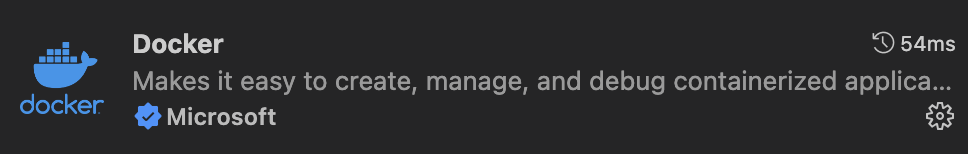

选择运行的容器即可
**复用开发环境**
上面已经下载了 nodejs 环境，比如你还可以使用 npm 下载一些全局的包如 vue、nrm等等，这样我们就创建了一个开发环境，为了复用这个开发环境需要将其打包成镜像推送到 docker hub 上
```powershell
# 登录 docker
docker login
# 将容器打包成镜像 docker container commit [容器名称] [镜像名称]
docker container commit fed fed
# 为镜像打 tag，因为镜像推送到 docker hub 中，要用 tag 来区分版本，这里我们先设置为 latest。tag 名称加上了用户名做命名空间，防止与 docker hub 上的镜像冲突。
docker tag fed huangzhaoping/fed:latest
# 将 tag 推送至 docker hub。
docker push huangzhaoping/fed:latest
```
## 使用 docker 私有部署项目
上面章节中，在开发环境创建项目推送到 docker hub，其他人从 docker hub 下载镜像就能开发项目了。但是不建议这样使用，镜像一般作为通用开发环境，不应该将代码放到上面
**部署单个项目**
在项目根目录创建 `Dockerfile` 描述配置
```dockerfile
# FROM [base镜像] 必须放在Dockerfile的第一行，表示从哪个baseimage开始构建
FROM node:slim

# MAINTAINER: 可选的，用来标识image作者的地方

# ADD & COPY
# 当在源代码构建的方式下，可以通过ADD和COPY的方式，把host上的文件或者目录复制到image中
# ADD和COPY的源必须在context路径下
# 当src为网络URL的情况下，ADD指令可以把它下载到dest的指定位置，这个在任何build的方式下都可以work
# ADD相对COPY还有一个多的功能，能够进行自动解压压缩包
COPY ./ /usr/local/app

# 用来指定当前工作目录（或者称为当前目录） 当使用相对目录的情况下，采用上一个WORKDIR指定的目录作为基准
WORKDIR /usr/local/app

# 一个Dockerfile中可以包含多个RUN，按定义顺序执行 每一个RUN指令都会是在一个新的container里面运行，并提交为一个image作为下一个RUN的base
RUN npm i

# CMD: 
# CMD的作用是作为执行container时候的默认行为（容器默认的启动命令）
# 当运行container的时候声明了command，则不再用image中的CMD默认所定义的命令
# 一个Dockerfile中只能有一个有效的CMD，当定义多个CMD的时候，只有最后一个才会起作用

# ENV key value
# 用来设置环境变量，后续的RUN可以使用它所创建的环境变量
ENV NODE_ENV dev

# EXPOSE <端口1> [<端口2>...]。
# EXPOSE 指令是声明运行时容器提供服务端口，这只是一个声明，在运行时并不会因为这个声明应用就会开启这个端口的服务。在 Dockerfile 中写入这样的声明有两个好处，一个是帮助镜像使用者理解这个镜像服务的守护端口，以方便配置映射；另一个用处则是在运行时使用随机端口映射时，也就是 docker run -P 时，会自动随机映射 EXPOSE 的端口。
EXPOSE 8090

# HEALTHCHECH 健康检查
# HEALTHCHECK CMD curl --fail http://localhost:5000/fundation || exit 1
```
写完整个项目后打包镜像
```powershell
# -t --tag 标识镜像名称 .代表 Dockerfile 路径
docker build -t mynodejsproject .
```
**部署多个项目**
当部署一个前后端项目时，需要 mysql redis nginx 等依赖，需要使用 `docker-compose`
在项目根目录新建 `docker-compose.yml` 文件
```yaml
# 版本
version: '3'
# 依赖的服务列表
services:
  nginx:
    # base镜像
    image: nginx:latest
    # 将服务的80端口映射宿主机的8080端口，使用-80可以将服务的80端口映射到宿主机的一个随机的端口上
    ports:
      - 8080:80
    # 出错重启
    restart: always  
    volumes:
    # 文件映射
      - ./nginx/conf.d:/etc/nginx/conf.d
      - ./nginx/nginx.conf:/etc/nginx/nginx.conf
      - /tmp/logs:/var/log/nginx

  redis-server:
    image: redis:latest
    ports:
      - 6479:6379
    restart: always

  app:
    # 服务路径
    build: ./
    volumes:
      - ./:/usr/local/app
    restart: always  
    working_dir: /usr/local/app
    command: node server/server.js
    # 通过depends_on告诉docker-compose当前服务启动之前先要把depends_on指定的服务启动起来才行。
    depends_on:
      - redis-server
    links:
    # links的目的是把一个服务的名称在当前服务里面创建一个别名，此时在app中的redis的ip为rd
      - redis-server:rd

      
```
```powershell
# -detach	-d	在后台运行容器
docker-compose up -d
```
代码仓库：[https://github.com/lemonliu2022/docker-web-example](https://github.com/lemonliu2022/docker-web-example)
# Nginx
## nginx托管静态资源出现的问题
```powershell
docker pull nginx
# eeb9db34b331
docker run -it --name nginx -p 9527:9527 -v /Users/didi/Desktop/temp:/etc/nginx/conf.d -v /Users/didi/Desktop/logs:/var/log/nginx eeb9db34b331 /bin/bash
```
> docker 命令解释
> -p 宿主机port:容器port 端口映射
> -v 宿主机目录:容器目录 磁盘目录映射 ⚠️**首次**是宿主机目录映射到容器，如果宿主机目录下无文件，容器中的文件也会被清除；采用此命令是官方nginx镜像中没有 vi、vim 命令，目录映射方便改动容器内的文件。也可以采用 vscode 左下角连接容器的方法改动容器内文件

```markdown
|-- /Users/didi/Desktop/temp
    |-- server.conf
    |-- foo
        |-- index.html
```
```nginx
server {
    listen       9527;
    listen  [::]:9527;
    server_name  localhost;

    location / {
        root   /usr/share/nginx/html;
        index  index.html index.htm;
    }

    location /foo {
      root   /etc/nginx/conf.d;
      index  index.html index.htm;
    }
    
    error_page   500 502 503 504  /50x.html;
    location = /50x.html {
        root   /usr/share/nginx/html;
    }
}
```
### 利用索引查找静态资源时会出现 301 重定向
使用浏览器访问下面两个地址，通过 nginx 配置的映射都可以找到 index.html 页面
http://localhost:9527/foo
查找名字为 foo 的资源，没有找到；但存在 foo 目录，nginx 会重定向查询此目录下是否含有 index.html的默认页面，产生 301 状态码
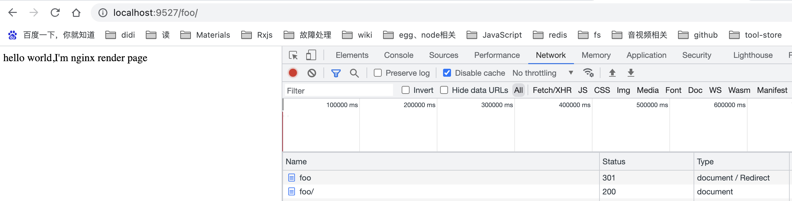
http://localhost:9527/foo/
查找 foo 目录下的资源，默认为 index.html
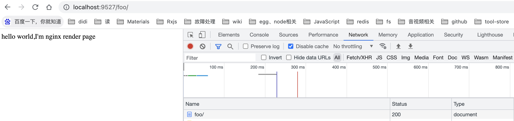
### try_files
按指定顺序检查文件是否存在，并使用第一个找到的文件进行请求处理；处理在当前上下文中执行。根据root和alias指令，从file参数构造文件路径。可以通过在名称末尾指定斜杠来检查目录是否存在，例如“$uri/”。如果没有找到任何文件，则会对最后一个参数中指定的uri进行内部重定向。
```nginx
location /foo {
  root   /etc/nginx/conf.d;
  #   index  index.html index.htm;
  try_files $uri $uri/ /foo/index.html;
}
```
最后一个参数最好设置一个 403 页面 ⚠️ 最后一个参数如果设置 index.html 则走 nginx 默认路径 /etc/nginx/htmlindex.html 显然是不对的，可以变成 /index.html 或者 其他默认地址

```powershell
git aa ff # 
```
# React

## 基础语法

### 事件对象

```jsx
{ /* 第一个参数即是事件对象，无需传递 */ }
<button onClick={this.eventHandler}>按钮</button>
{ /* 需要传递其他参数 */ }
<button onClick={e => this.eventHandler('arg', e)}
{ /* 最后一个即是事件对象 */ }
<button onClick={this.eventHandler.bind(null, 'arg')}
```

### Ref

1. createRef

```jsx
class Input extends Component{
  constructor() {
    super()
    this.inputRef = React.createRef()
  }
  render() {
    return (
    	<div>
      	<input type="text" ref={this.inputRef} />
        { /* this.inputRef.current 即是 */ }
      </div>
    )
  }
}
```

2. 函数参数

```jsx
class Input extends Component{
  render() {
    return (
    	<div>
      	<input type="text" ref={input => (this.input = input)} />
        { /* this.input 即是 */ }
      </div>
    )
  }
}
```

### Hooks

> 副作用： 在组件中，只要不是将数据转换成视图的代码，都是副作用。例如：获取DOM元素，为DOM元素添加事件，设置定时器，发送Ajax等等


对函数型组件进行增强, 让函数型组件可以存储状态, 可以拥有处理副作用的能力.

让开发者在不使用类组件的情况下, 实现相同的功能. **React16.8以后推荐使用**

#### Hooks要解决的问题

1. 逻辑复用
   类组件的高阶组件增加了无实际渲染效果的组件，增加组件层级，十分臃肿，增加调试难度，运行效率降低
2. 类组件经常会变得很复杂难以维护
   将一组相干的业务逻辑拆分到了多个生命周期函数中
   在一个生命周期函数内存在多个不相干的业务逻辑
3. 类成员方法不能保证this指向的正确性

#### useState

- 普通函数在执行完成之后，内部的变量就会被释放掉，而useState内部使用闭包来保存变量
- 参数可以是一个函数，函数返回什么，初始状态就是什么，函数只会调用一次，用在初始值是动态值的情况

```jsx
function App(props) {
  // wrong
  // const propsCount = props.count | 0; // 这种方式可以定义初始状态，但是每次渲染都会调用
  
  // right
  const [count, setCount] = useState(() => {
    return props.count | 0; // 只会在第一次渲染时执行
  })
}
```

- 设置状态值方法的参数可以是一个值也可以是一个函数(函数可以操作本身数据)
- 设置状态值方法的方法本身是异步的
- 原理

```jsx
let states = []
let setters = []
let stateIndex = 0;

function createSetter(index) {
	return function (newState) { // 重点：闭包 保存index不被释放
		states[index] = newState;
		render();
	}
}

function useState(initialState) {
  states[stateIndex] = states[stateIndex] ? states[stateIndex] : initialState
  setters.push(createSetter(stateIndex))
  let value = states[stateIndex];
  let setter = createSetter(stateIndex)
  stateIndex++;
  return [value, setter]
}

function render() {
	stateIndex = 0;
	ReactDOM.render(<App />, document.getElementById('root'))
}
```

#### useReducer

1. 应用场景
   - 如果你的`state`是一个数组或者对象
   - 如果你的`state`变化很复杂，经常一个操作需要修改很多state
   - 如果你希望构建自动化测试用例来保证程序的稳定性
   - 如果你需要在深层子组件里面去修改一些状态 useReducer + useContext
   - 如果你用应用程序比较大，希望UI和业务能够分开维护

> useState 实现登录页

```jsx
function LoginPage() {
        const [name, setName] = useState(''); // 用户名
        const [pwd, setPwd] = useState(''); // 密码
        const [isLoading, setIsLoading] = useState(false); // 是否展示loading，发送请求中
        const [error, setError] = useState(''); // 错误信息
        const [isLoggedIn, setIsLoggedIn] = useState(false); // 是否登录

        const login = (event) => {
            event.preventDefault();
            setError('');
            setIsLoading(true);
            login({ name, pwd })
                .then(() => {
                    setIsLoggedIn(true);
                    setIsLoading(false);
                })
                .catch((error) => {
                    // 登录失败: 显示错误信息、清空输入框用户名、密码、清除loading标识
                    setError(error.message);
                    setName('');
                    setPwd('');
                    setIsLoading(false);
                });
        }
        return ( 
            //  返回页面JSX Element
        )
    }
```

> useReducer 开发登录页

```jsx
// useReducer 实现登录页
    const initState = {
        name: '',
        pwd: '',
        isLoading: false,
        error: '',
        isLoggedIn: false,
    }
    function loginReducer(state, action) {
        switch(action.type) {
            case 'login':
                return {
                    ...state,
                    isLoading: true,
                    error: '',
                }
            case 'success':
                return {
                    ...state,
                    isLoggedIn: true,
                    isLoading: false,
                }
            case 'error':
                return {
                    ...state,
                    error: action.payload.error,
                    name: '',
                    pwd: '',
                    isLoading: false,
                }
            default: 
                return state;
        }
    }
    function LoginPage() {
        const [state, dispatch] = useReducer(loginReducer, initState);
        const { name, pwd, isLoading, error, isLoggedIn } = state;
        const login = (event) => {
            event.preventDefault();
            dispatch({ type: 'login' });
            login({ name, pwd })
                .then(() => {
                    dispatch({ type: 'success' });
                })
                .catch((error) => {
                    dispatch({
                        type: 'error'
                        payload: { error: error.message }
                    });
                });
        }
        return ( 
            //  返回页面JSX Element
        )
    }
```

#### useContext

1. 应用场景
   组件之间共享状态, 简化了context提供的Consumer组件

```jsx
// 定义 context函数
    const LoginContext = React.createContext();
    function LoginPage() {
        const [state, dispatch] = useReducer(loginReducer, initState);
        const { name, pwd, isLoading, error, isLoggedIn } = state;
        const login = (event) => {
            event.preventDefault();
            dispatch({ type: 'login' });
            login({ name, pwd })
                .then(() => {
                    dispatch({ type: 'success' });
                })
                .catch((error) => {
                    dispatch({
                        type: 'error'
                        payload: { error: error.message }
                    });
                });
        }
        // 利用 context 共享dispatch
        return ( 
            <LoginContext.Provider value={{dispatch}}>
                <...>
                <LoginButton />
            </LoginContext.Provider>
        )
    }
    function LoginButton() {
        // 子组件中直接通过context拿到dispatch，出发reducer操作state
        const dispatch = useContext(LoginContext);
        const click = () => {
            if (error) {
                // 子组件可以直接 dispatch action
                dispatch({
                    type: 'error'
                    payload: { error: error.message }
                });
            }
        }
    }
```

#### useEffect

1. 执行时机
   - useEffect(() => {})             =>     componentDidMount, componentDidUpdate
   - useEffect(() => {}, [])         =>     componentDidMount
   - useEffect(() => () => {})     =>     componentWillUnMount
2. 解决的问题
   - 按照用途将代码进行分类 (将一组相干的业务逻辑归置到了同一个副作用函数中)
   - 简化重复代码, 使组件内部代码更加清晰
3. 结合异步函数

```jsx
useEffect(() => {
  (async ()=> {
    	await axios.get()
  })()
})

// wrong
useEffect(async () => {
  // 改变了原有函数的返回值
})
```

4. 原理

```jsx
function render() {
	stateIndex = 0;
	effectIndex = 0;
	ReactDOM.render(<App />, document.getElementById('root'))
}

let prevDepsAry = []
let effectIndex = 0

function useEffect(callback, depsAry) {
	// 判断callback是不是函数
	if(Object.prototype.toString.call(callback) === '[object Function]') throw new Error()
	// 判断depsAry有没有被传递
	if(typeof depsAry === 'undefined') {
		// 没有传递
		callback()
	} else {
		// 判断depsAry是不是数组
		if(Object.prototype.toString.call(callback) === '[object Array]') throw new Error()
		// 获取上一次状态值
		let prevDeps = prevDepsAry[effectIndex]
		//将当前依赖值和上一次依赖值做对比 如果有变化 调用callback
		let hasChanged = prevDeps ? depsAry.every((dep, index) => dep === prevDeps) === false : true;
		if(hasChanged) {
			callback();
		}
		prevDeps[effectIndex] = depsAry;
		effectIndex++;
	}
}
```

#### useMemo

> useMemo 的行为类似Vue中的计算属性, 可以监测某个值的变化, 根据变化值计算新值.
> useMemo 会缓存计算结果. 如果监测值没有发生变化, 即使组件重新渲染, 也不会重新计算. 此行为可以有助于避免在每个渲染上进行昂贵的计算.


#### momo

性能优化, 如果本组件中的数据没有发生变化, 阻止组件更新. 类似类组件中的 PureComponent 和 shouldComponentUpdate

#### useCallback

性能优化, 缓存函数, 使组件重新渲染时得到相同的函数实例,保证传入子组件的函数相同,不重新渲染。

## 性能优化之useMemo、useCallback
[「好文翻译」为什么你可以删除 90% 的 useMemo 和 useCallback ？ - 掘金](https://juejin.cn/post/7251802404877893689)
总结：页面主要耗时发生在「大计算+重渲染」如长列表重排序，其他情况一般无需考虑缓存，反而会降低代码可读性
## 性能优化之key
[「好文翻译」React key属性：高性能列表的最佳实践 - 掘金](https://juejin.cn/post/7257022428194521145)
总结：列表变更会经历节点 unmount => mount => re-render，列表重排序使用 id 为 key 只会 re-render 优化性能。在表格分页场景下 index 作为 key 可能比 id 性能更好（个人测试生产环境偶尔比开发环境要好，但交互是点击按钮后还显示原来图片，过几秒才变化）
## Ref 原理解读
[react框架ref系列API的用法及原理解析 - 掘金](https://juejin.cn/post/7282290326068052023)
[「好文翻译」React 中的 Refs，从操作 DOM 到指令式 API - 掘金](https://juejin.cn/post/7291186330911326266)


# Vue

## ElementUI编辑数据resetFields失效

这是一个在对数据进行添加和编辑经常出现的问题，添加和编辑共用一个组件，在添加或编辑之后使用 form 的 `resetFields` 将 form 中的数据清空。在添加的时候没有出现问题，唯独在编辑时出现问题，代码如下：

```javascript
editVideo(row) {
   this.isEditMode = true
   this.dialogFormVisible = true
 	 this.videoForm = row
}
```

研究 `resetFields` 源码之后发现了问题：

- resetFields 方法调用其实就是恢复 form 的初始值
- 在添加时 form 的初始值就是我们定义的默认数据如下：

```javascript
videoForm: {
	name: '',
  labels: [],
  video_url: '',
  relate_id: '',
  comment: ''
}
```

在调用这个函数之后，form 实例上的初始值还原成上面的数据

- 这个编辑值是在 form 组件 `mounted` 生命周期赋值上去的
- 我们如果在创建 form 组件时就 `this.videoForm = row` 这样赋值，form 组件默认值就是 `row` 数据了
- 所以我们可以使用 `this.$nextTick()` 在组件渲染完成之后给组件赋值，如下

```javascript
editVideo(row) {
   this.isEditMode = true
   this.dialogFormVisible = true
 	 this.$nextTick(() => {
   		this.videoForm = row
   })
}
```


# 工程化

## moment-locales-webpack-plugin插件

在开发微信小程序时，打包出来的 vendor 文件太大，无法在线预览，排查出来是 moment 在打包时如果不配置会将所有语言的包全量导入。

```javascript
// webpack.config.js
const MomentLocalesPlugin = require('moment-locales-webpack-plugin');
 
module.exports = {
    plugins: [
        // To strip all locales except “en”
        new MomentLocalesPlugin(),
 
        // Or: To strip all locales except “en”, “es-us” and “ru”
        // (“en” is built into Moment and can’t be removed)
        new MomentLocalesPlugin({
            localesToKeep: ['es-us'],
        }),
    ],
};
```


## 前端请求错误优雅处理

在日常开发中，经常出现由于后端报错导致整个系统都不可用的情况，原因总结有两个：

+ 前端封装函数使用promise，reject了一种情况，调用者没有捕获异常(如加入try..catch/.catch)，函数return了，return下面的逻辑未执行
+ 后端报错，前端取不到后端响应数据，比如`Cannot read properties of undefined`,程序不再往下执行

### promise函数封装

滴滴将一些可配置数据放在服务端，这些配置可以通过SDK或者请求后端接口获取。考虑到安全性，获取配置都通过后端接口；考虑到稳定性，SDK方式保留作为兜底。SDK方式可以看成函数的封装

```javascript
export const $_getApolloToggle = (apolloKey, restParams, notProcess = false) => 
new Promise((resolve, reject) => {
  // 没有引入Apollo SDK
  if (!window.Apollo || !window.Apollo.getToggle) {
    console.log(window.Apollo, window.Apollo.getToggle);
    reject(new Error('Apollo.getToggle 不存在'));
    return;
  }
  window.Apollo.getToggle({
    ns: 'uemc',
    key: 'kefu-fe',
    name: apolloKey,
    ...restParams,
  }, res => {
    if (res.code) {
      trackOmega('tech_apollo_response_fail', { code: res.code });
      reject(new Error('配置数据不存在'));
      console.log(res);
      return;
    }
    resolve(notProcess ? res.data : res.data[apolloKey]);
  });
});
```

里面做了两个错误处理。思考一下，其中一个情况被触发，promise 会变成 reject 状态，调用方的.catch函数执行，.then函数不执行，如果调用方没有做定制的错误处理，.then函数里的逻辑就不会执行了。

#### 修改思路

借鉴下 Promise.all 的一个痛点，如果 Promise.all 中的一个promise reject了，整个 all 函数就 reject，其中一个解决思路是把promise再封装一层

```javascript
/**
 * @param {Promise} p 
 */
async function promiseWithError(p) {
  try {
    const res = await p;
    return {
      err: 0,
      data: res
    };
  } catch(e) {
    return {
      err: 1
    }
  }
}
```

这样这个函数就总能返回 resolve 的值了，成功与否通过 err 判断

回到正题，我们试着把函数封装中的所有 reject 都改为 resolve, 然后返回数据中加入 判断成功与否的标志error

#### 实践

```javascript
export const getApolloToggleBySDK = ({ name, params }) =>
  Promise.race([
    new Promise(resolve => {
      if (!window.Apollo || !window.Apollo.getToggle) {
        console.error(
          window.Apollo,
          window.Apollo.getToggle,
          'Apollo.getToggle 不存在',
        );
        resolve({ error: { code: 9999, message: 'Apollo.getToggle 不存在' } });
        return;
      }
      window.Apollo.getToggle({ ns: 'uemc', key: 'kefu-fe', name, ...params },
        res => {
          if (res.code) {
            trackOmega('tech_apollo_response_fail', {
              code: res.code,
              msg: '配置数据不存在',
            });
            console.error(res, '配置数据不存在');
            resolve({ error: { code: 9999, message: '配置数据不存在' } });
            return;
          }
          resolve({ data: res.data });
        },
      );
    }),
    new Promise(resolve => {
      setTimeout(() => {
        resolve({ error: { code: 9999, message: 'apollo返回时间超过1s' } });
        trackOmega('tech_apollo_response_fail', { msg: 'apollo返回时间超过1s' });
      }, 1000);
    }),
  ]);
```

调用

```javascript
export const getNewApolloToggle = async params => {
  if (location.href.includes('hongyibo')) {
    const res = await getApolloToggleBySDK(params);
    return { ...res, fromSDK: true };
  }
  const apiRes = await getApolloToggleByAPI(params);
  if (!apiRes.error) return { ...apiRes, fromSDK: false };
  // 通过后端获取接口down掉 兜底SDK
  const sdkRes = await getApolloToggleBySDK(params);
  return { ...sdkRes, fromSDK: true };
};
```

### axios封装

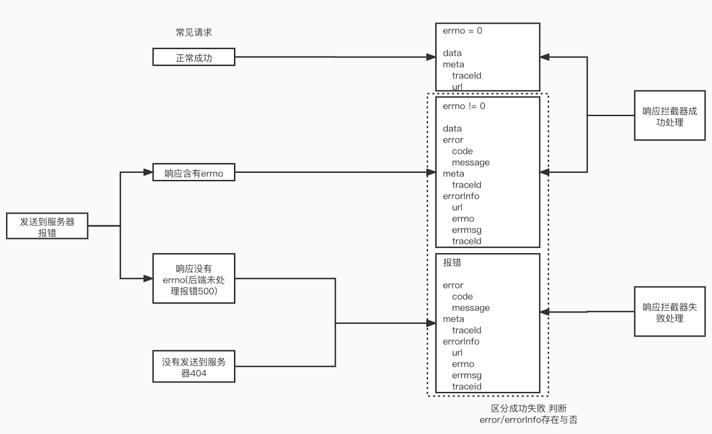


# 杂七杂八

## 使用vnc访问远程系统

1. 首先远程要有个 vnc 服务，这里使用 tigervnc-server

```shell
docker pull centos
docker run --name centos-desktop-gnome --privileged -d -p 9527:5901 --ulimit memlock=-1 -td centos /usr/sbin/init	# 启动容器, 并暴露端口，远程桌面端口是5901
# 安装并使用图形界面
yum group install -y "GNOME Desktop"
systemctl set-default graphical.target # 系统的默认运行级别设置为图形界面(GUI)模式
lsb_release -a # 查看操作系统版本
yum install -y tigervnc-server # 安装vnc服务
# 开机启动 noVnc
systemctl enable novnc@:1.service
systemctl start novnc@:1.service
# 关闭防火墙
systemctl disable firewalld # 重启不恢复
systemctl stop firewalld
# 查看防火墙状态
firewall-cmd --state
```

2. 给 vnc 服务设置访问密码

```shell
vncpasswd # 输入两次6位及以上密码，并询问你是否开启只读模式
```

也可以无需密码访问

```shell
vi /root/.vnc/config
```

打开securitytypes=none,tlsvnc注释并修改参数值，保存文件退出。

3. 启动 vnc 服务

```shell
vncserver :1 # 默认 :1是5901端口，:2为5902端口，以此类推
theIp=`ifconfig | grep inet | head -n1 | awk '{print $2}'` # 当前ip
echo "---------- success -------------"
echo "vnc start at ${theIp}:5901"
# 关闭服务
vncserver -kill :1
```

4. 验证是否可访问
   下载 vnc-viewer 客户端
   [vnc-viewer官网](https://www.realvnc.com/en/connect/download/viewer/)
   输入 ip + port 访问

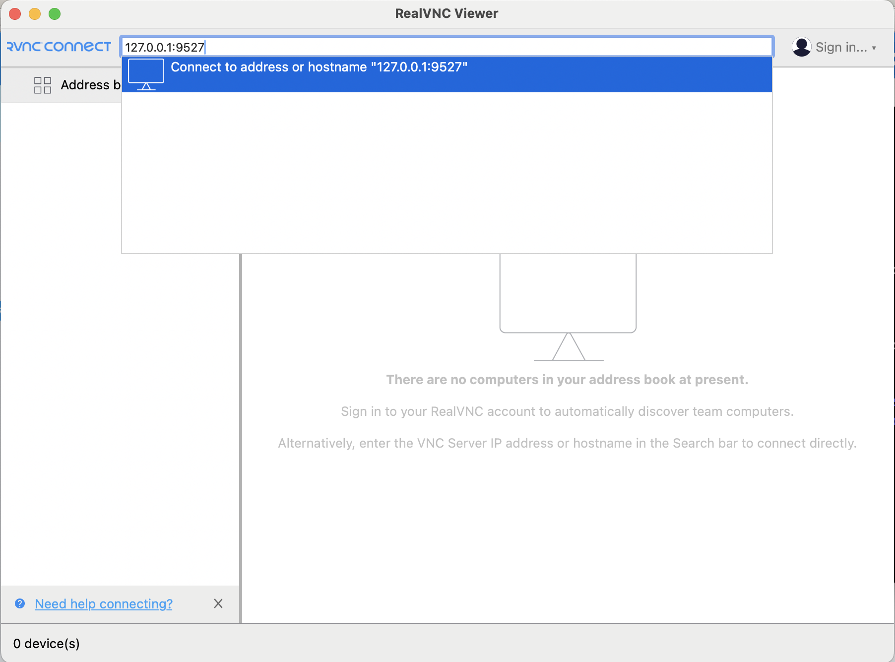


5. 使用 noVnc 通过浏览器访问 vnc 服务
   原理：vnc 为 tcp 服务，启动 websocket 与其连接，并将服务代理

```shell
cd /root
yum -y install git
# git clone https://github.com/novnc/noVNC.git
git clone https://github.com/novnc/noVNC.git
cd /root/noVNC/utils
# git clone https://github.com/novnc/websockify
git clone https://github.com/novnc/websockify
yum -y install python3
pip3 install numpy
# 启动 noVnc 服务
/root/noVNC/utils/novnc_proxy --vnc 127.0.0.1:5901
```

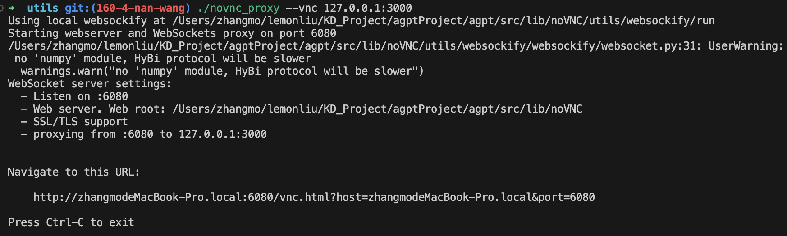


```shell
# mac 查看端口占用
lsof -i:[PORT]
# 杀掉进程
kill -9 [PID]
```

6. noVnc 服务如果在 electron 里可以可能需要通过端口号杀掉进程

```js
// 函数：通过端口号杀掉进程
function killProcessByPort(port, callback) {
  // 根据操作系统选择命令
  let command;
  if (process.platform === 'win32') {
    command = `netstat -ano | findstr :${port} | findstr LISTENING | %a{ for /f "tokens=5" %b in ('findstr /R /N "^"') do if /I %b LSS 50 (taskkill /PID %b /F) }`;
  } else if (process.platform === 'darwin') {
    command = `lsof -i tcp:${port} | grep LISTEN | awk '{print $2}' | xargs kill -9`;
  } else { // Linux/Unix
    command = `lsof -i :${port} | grep LISTEN | awk '{print $2}' | xargs kill -9`;
  }
 
  // 执行系统命令
  exec(command, (error, stdout, stderr) => {
    if (error) {
      console.error(`执行出错: ${error}`);
      return;
    }
    console.log(`stdout: ${stdout}`);
    console.error(`stderr: ${stderr}`);
    callback(); // 回调函数
  });
}
 
// 使用示例
killProcessByPort(8080, () => {
  console.log('端口占用进程已杀掉');
});
```

## mac安装windows虚拟机

原本想使用 docker 安装操作系统镜像，然后使用 vnc 连接容器的，参考文章 => [把Windows 装进 Docker 容器里](https://zhuanlan.zhihu.com/p/686351917)

运行 docker compose 时报错，`no such file /dev/kvm` ，试了半天行不通，后来才知道 kvm 为内核虚拟化，**macOS 和 windows 10不支持**，可以通过 `QEMU` 工具模拟或者使用虚拟化技术来模拟一个 Linux 环境，简称套娃

后来想起来 VMWare 对个人免费了，决定使用它

需要先在 Broadcom 注册下载 VMware Fusion

在**微软官网**下载操作系统

最新的 windows 11 系统初始化引导时必须连接网络，按下 **Shift + F10** 打开命令行窗口输入 `oobe\BypassNRO` 跳过网络检查

## Mac 新电脑环境安装 2024.09.23

> 背景：最近经常换电脑，每次重新配置环境百度查教程找到的都不一样，筛选半天费时费力，决定记录下来

1. 安装 chrome, [iTerm2](https://iterm2.com/), vscode，[lemon](https://lemon.qq.com/)
2. chrome 登陆账号。如果不能翻墙，使用免费的插件 [SetupVPN](https://sxkk.throat.team//public/s/browser/chrome/)
3. 安装 brew。国内镜像

```shell
/bin/zsh -c "$(curl -fsSL https://gitee.com/cunkai/HomebrewCN/raw/master/Homebrew.sh)"
```

4. 安装 ohmyzsh。国内镜像

```shell
sh -c "$(curl -fsSL https://gitee.com/shmhlsy/oh-my-zsh-install.sh/raw/master/install.sh)"
```

安装成功后会生成 ~/.zshrc 用于配置

5. 安装 ohmyzsh 插件。命令高亮，自动提示

```shell
cd ~/.oh_my_zsh/plugins
git clone https://github.com/zsh-users/zsh-syntax-highlighting.git
git clone https://github.com/zsh-users/zsh-autosuggestions.git
```

编辑 ~/.zshrc

```zshrc
plugins=(
    # other plugins...
    zsh-autosuggestions
    zsh-syntax-highlighting
)
```

6. 安装 nvm。

```shell
brew install nvm
```

安装完成后把最后的一段代码复制到 ~/.zshrc 最后，然后 source 保存

```shell
export NVM_DIR="$HOME/.nvm"
  [ -s "/opt/homebrew/opt/nvm/nvm.sh" ] && \. "/opt/homebrew/opt/nvm/nvm.sh"  # This loads nvm
  [ -s "/opt/homebrew/opt/nvm/etc/bash_completion.d/nvm" ] && \. "/opt/homebrew/opt/nvm/etc/bash_completion.d/nvm"  # This loads nvm bash_completion
```

apple 芯片安装 nvm 后无法安装 node，需配置镜像，也是在 ~/.zshrc 中添加

```shell
export NVM_NODEJS_ORG_MIRROR=https://npmmirror.com/mirrors/node/
```

## 终端代理

自用 laddervpn 翻墙，但它的功能里没有**复制终端代理命令**的选项，所以一直没用过终端代理

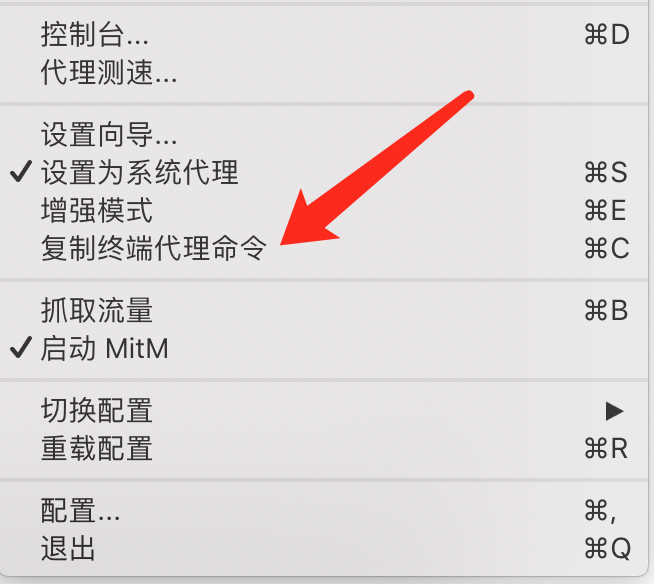

一、首先找到代理端口，打开梯子后可以在 **wifi ->详细信息->代理**  查看

二、编辑 `.zshrc`  文件，创建两个命令

```powershell
# proxy list
alias proxy='export https_proxy=http://127.0.0.1:9090;export http_proxy=http://127.0.0.1:9090;export all_proxy=socks5://127.0.0.1:9091'
alias unproxy='unset all_proxy https_proxy http_proxy'
```

三、查看效果

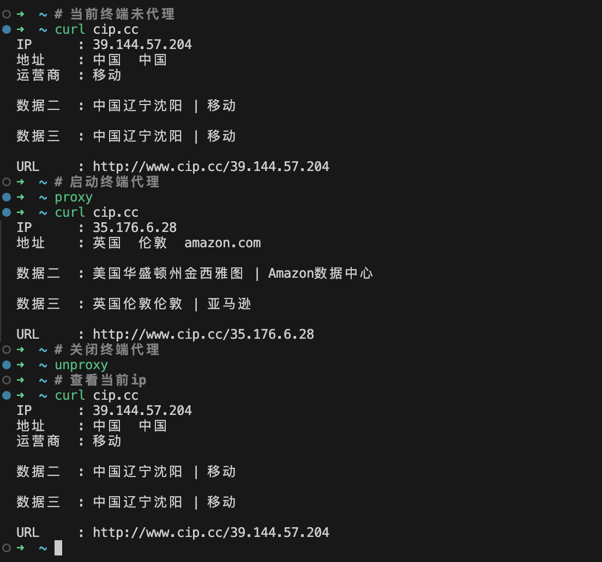

